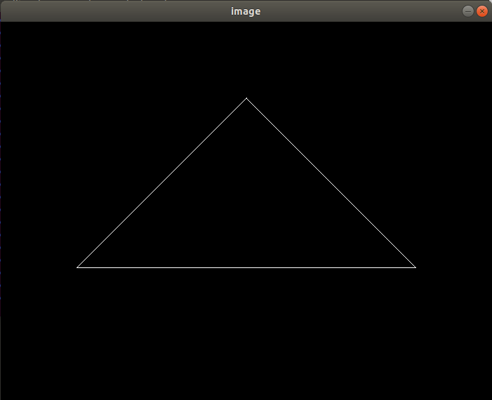
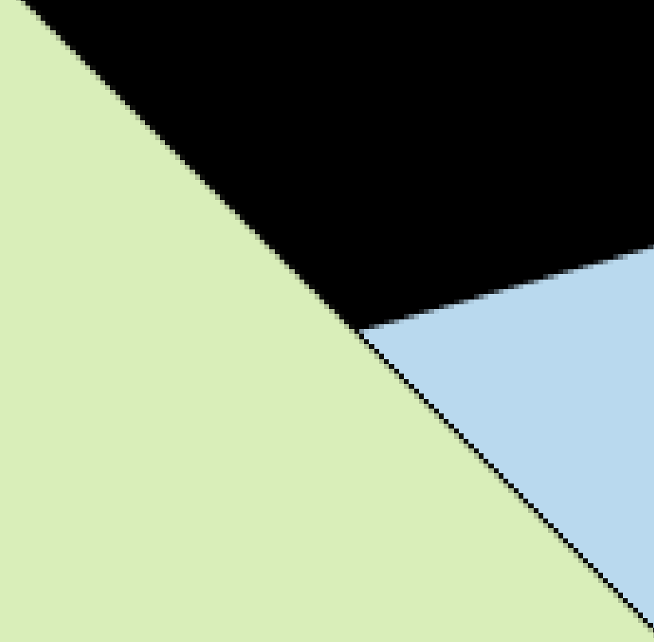

# Assignment 1

本次作业实现了MVP变换，实现流程如下：

1. 进行model变换，代码如下：

   ```cpp
   Eigen::Matrix4f get_model_matrix(float rotation_angle)
   {
       Eigen::Matrix4f model = Eigen::Matrix4f::Identity();
   
       // TODO: Implement this function
       // Create the model matrix for rotating the triangle around the Z axis.
       // Then return it.
       Eigen::Matrix4f translate;
   
       //rotate around z axis
       translate << cos(rotation_angle / 180.0 * MY_PI), -sin(rotation_angle / 180.0 * MY_PI), 0, 0,
                   sin(rotation_angle / 180.0 * MY_PI), cos(rotation_angle / 180.0 * MY_PI), 0, 0,
                   0, 0, 1, 0,
                   0, 0, 0, 1;
   
       model = translate * model;
   
       return model;
   }
   ```

   

2. 进行view变换，作业中出于简化相机始终看向-z方向，于是只需要进行平移变换，根据$T_{view} = \left[
   \matrix{
     1 & 0 & 0 & -x_e\\
     0 & 1 & 0 & -y_e\\
     0 & 0 & 1 & -z_e\\
     0 & 0 & 0 & 1
   }
   \right]$可得到代码如下：

   ```cpp
   Eigen::Matrix4f get_view_matrix(Eigen::Vector3f eye_pos)
   {
       Eigen::Matrix4f view = Eigen::Matrix4f::Identity();
   
       Eigen::Matrix4f translate;
       translate << 1, 0, 0, -eye_pos[0], 0, 1, 0, -eye_pos[1], 0, 0, 1,
           -eye_pos[2], 0, 0, 0, 1;
   
       view = translate * view;
   
       return view;
   }
   ```

   

3. 进行透视投影，根据$M_{persp} = 
   \left[
   \matrix{  
   \frac{2}{r-l} & 0 & 0 & 0\\  
   0 & \frac{2}{t-b} & 0 & 0\\  
   0 & 0 & \frac{2}{n-f} & 0\\  
   0 & 0 & 0 & 1}
   \right]
   \left[
   \matrix{  
   1 & 0 & 0 & -\frac{l+r}{2}\\  
   0 & 1 & 0 & -\frac{b+t}{2}\\  
   0 & 0 & 1 & -\frac{f+n}{2}\\  
   0 & 0 & 0 & 1}
   \right]\left[
   \matrix{
   n & 0 & 0 & 0 \\ 0 & n & 0 & 0 \\ 0 & 0 & n+f & -nf \\ 0 & 0 & 1 & 0
   }
   \right]$，可得到代码如下：

   ```cpp
   Eigen::Matrix4f get_projection_matrix(float eye_fov, float aspect_ratio,
                                         float zNear, float zFar)
   {
       // Students will implement this function
   
       Eigen::Matrix4f projection = Eigen::Matrix4f::Identity();
   
       // TODO: Implement this function
       // Create the projection matrix for the given parameters.
       // Then return it.
   
       //输入的n, f是正数
       float n = -zNear, f = -zFar;
       float t = tan(0.5 * eye_fov * MY_PI / 180.0) * -n, b = -t;
       float r = t * aspect_ratio, l = -r;
   
       //perspective -> orth
       Eigen::Matrix4f persp2ortho;
       persp2ortho << n, 0, 0, 0,
                           0, n, 0, 0,
                           0, 0, n + f, -1.0 * n * f,
                           0, 0, 1, 0;
   
       Eigen::Matrix4f scale, translate;
       translate << 1, 0, 0, -(l + r) * 0.5,
                   0, 1, 0, -(b + t) * 0.5,
                   0, 0, 1, -(n + f) * 0.5,
                   0, 0, 0, 1;
       scale << 2.0 / (r - l), 0, 0, 0,
               0, 2.0 / (t - b), 0, 0, 
               0, 0, 2.0 / (n - f), 0,
               0, 0, 0, 1;
       Eigen::Matrix4f ortho = scale * translate; 
   
       projection = ortho * persp2ortho * projection;
   
       return projection;
   }
   ```

4. 最终实现效果图如下：

   

5. 旋转20°后得到效果图如下：

   

# Assignment 2

本次作业主要在上一次作业的基础上自己实现函数rasterize_triangle(const Triangle& t)，实现流程如下：

1. 找到bound-box以减少采样的计算量，代码如下：

   ```cpp
   int min_x = (int)std::floor(std::min({v[0].x(), v[1].x(), v[2].x()}));
   int max_x = (int)std::ceil(std::max({v[0].x(), v[1].x(), v[2].x()}));
   int min_y = (int)std::floor(std::min({v[0].y(), v[1].y(), v[2].y()}));
   int max_y = (int)std::ceil(std::max({v[0].y(), v[1].y(), v[2].y()}));
   ```

2. 对bound-box内的每一个像素点进行z-buffer，根据重心坐标插值出每个像素点的z值后与depth_buf数组对应的位置z进行比较，若当前像素的z更小，则进行更新，代码如下：

   ```cpp
   for (int x = min_x; x <= max_x; x ++)
       for (int y = min_y; y <= max_y; y ++ ) {
           if (insideTriangle(x + 0.5, y + 0.5, t.v)) {
               //使用重心坐标计算插值
               auto [alpha, beta, gamma] = computeBarycentric2D(x + 0.5, y + 0.5, t.v);
               //z_interpolated要乘以w_reciprocal的原因是为了进行透视校正插值
               //即在投影变换后保持深度和顶点属性的正确比例关系
               float w_reciprocal = 1.0 / (alpha / v[0].w() + beta / v[1].w() + gamma / v[2].w());
               float z_interpolated = alpha * v[0].z() / v[0].w() + beta * v[1].z() / v[1].w() + gamma * v[2].z() / v[2].w();
               z_interpolated *= w_reciprocal;
               if (z_interpolated < depth_buf[get_index(x, y)]) {
                   depth_buf[get_index(x, y)] = z_interpolated;
                   set_pixel(Eigen::Vector3f(x, y, z_interpolated), t.getColor());
               }
           }
       }
   ```
   
3. 实现效果图如下：

   

   但是可以发现明显的锯齿：

   

4. 使用MSAA进行抗锯齿，将一个像素点再分成多个超像素点进行采样，代码如下：

   ```cpp
   //4*4 MSAA
   std::vector<Eigen::Vector2f> d4{
       {0.125,0.125},
       {0.125,0.375},
       {0.125,0.625},
       {0.125,0.875},
       {0.375,0.125},
       {0.375,0.375},
       {0.375,0.625},
       {0.375,0.875},
       {0.625,0.125},
       {0.625,0.375},
       {0.625,0.625},
       {0.625,0.875},
       {0.875,0.125},
       {0.875,0.375},
       {0.875,0.625},
       {0.875,0.875},
   };
   for (int x = min_x; x <= max_x; x ++ )
       for (int y = min_y; y <= max_y; y ++ ) {
           // float z_interpolated_min = std::numeric_limits<float>::max();
           int cnt = 0;
           //将一个像素分成4*4个超像素，统计在三角形内的超像素个数用于后续颜色的淡化
           for (int i = 0; i < 16; i ++ ) {
               if (insideTriangle(x + d4[i].x(), y + d4[i].y(), t.v)) {
                   cnt ++;
               }
           }
           if (cnt) {
               //使用重心坐标计算插值
               auto [alpha, beta, gamma] = computeBarycentric2D(x + 0.5, y + 0.5, t.v);
               //z_interpolated要乘以w_reciprocal的原因是为了进行透视校正插值
               //即在投影变换后保持深度和顶点属性的正确比例关系
               float w_reciprocal = 1.0 / (alpha / v[0].w() + beta / v[1].w() + gamma / v[2].w());
               float z_interpolated = alpha * v[0].z() / v[0].w() + beta * v[1].z() / v[1].w() + gamma * v[2].z() / v[2].w();
               z_interpolated *= w_reciprocal;
               if (z_interpolated < depth_buf[get_index(x, y)]) {
                   depth_buf[get_index(x, y)] = z_interpolated;
                   set_pixel(Eigen::Vector3f(x, y, z_interpolated), t.getColor() * cnt / 16.0);
               }
           }
       }
   ```
   
5. 使用MSAA后的效果图如下：

   

# Assignment 3

本次作业在上次作业的基础上，插值出更多的属性，实现流程如下：

1. 插值出color,normal,texcoords,shadingcoords等属性，并将其放入fragment_shader_payload中，代码如下：

   ```cpp
   for (int x = min_x; x <= max_x; x ++)
       for (int y = min_y; y <= max_y; y ++ ) {
           if (insideTriangle(x + 0.5, y + 0.5, t.v)) {
               auto [alpha, beta, gamma] = computeBarycentric2D(x + 0.5, y + 0.5, t.v);
   
               float Z = 1.0 / (alpha / v[0].w() + beta / v[1].w() + gamma / v[2].w());
               float zp = alpha * v[0].z() / v[0].w() + beta * v[1].z() / v[1].w() + gamma * v[2].z() / v[2].w();
               zp *= Z;
   
               if (zp < depth_buf[get_index(x, y)]) {
                   depth_buf[get_index(x, y)] = zp;
                   auto interpolated_color = interpolate(alpha, beta, gamma, t.color[0], t.color[1], t.color[2], 1.0);
                   auto interpolated_normal = interpolate(alpha, beta, gamma, t.normal[0], t.normal[1], t.normal[2], 1.0);
                   auto interpolated_texcoords = interpolate(alpha, beta, gamma, t.tex_coords[0], t.tex_coords[1], t.tex_coords[2], 1.0);
                   auto interpolated_shadingcoords = interpolate(alpha, beta, gamma, view_pos[0], view_pos[1], view_pos[2], 1.0);
   
                   fragment_shader_payload payload( interpolated_color, interpolated_normal.normalized(), interpolated_texcoords, texture ? &*texture : nullptr);
                   payload.view_pos = interpolated_shadingcoords;
   
                   auto pixel_color = fragment_shader(payload);
                   set_pixel(Vector2i(x, y),pixel_color);
               }
   
           }
       }
   ```

2. 修改函数phong_fragment_shader()，实现Blinn-Phong 模型计算Fragment Color，代码如下：

   ```cpp
   Eigen::Vector3f phong_fragment_shader(const fragment_shader_payload& payload)
   {
       Eigen::Vector3f ka = Eigen::Vector3f(0.005, 0.005, 0.005);
       Eigen::Vector3f kd = payload.color;
       Eigen::Vector3f ks = Eigen::Vector3f(0.7937, 0.7937, 0.7937);
   
       auto l1 = light{{20, 20, 20}, {500, 500, 500}};
       auto l2 = light{{-20, 20, 0}, {500, 500, 500}};
   
       std::vector<light> lights = {l1, l2};
       Eigen::Vector3f amb_light_intensity{10, 10, 10};
       Eigen::Vector3f eye_pos{0, 0, 10};
   
       float p = 150;
   
       Eigen::Vector3f color = payload.color;
       Eigen::Vector3f point = payload.view_pos;
       Eigen::Vector3f normal = payload.normal;
   
       Eigen::Vector3f result_color = {0, 0, 0};
   
       //环境光照，只计算一次不依赖光源的位置和方向
       Eigen::Vector3f La = ka.cwiseProduct(amb_light_intensity);
       result_color += La;
       for (auto& light : lights)
       {
           // TODO: For each light source in the code, calculate what the *ambient*, *diffuse*, and *specular* 
           // components are. Then, accumulate that result on the *result_color* object.
   
           //光照方向
           Eigen::Vector3f light_dir = light.position - point;
           //视角方向
           Eigen::Vector3f view_dir = eye_pos - point;
           //半程向量
           Eigen::Vector3f h = (light_dir + view_dir).normalized();
           //衰减因子r
           float r = light_dir.dot(light_dir);
           //漫反射光照
           Eigen::Vector3f Ld = kd.cwiseProduct(light.intensity / r) * std::max(0.0f, normal.normalized().dot(light_dir.normalized()));
           //高光
           Eigen::Vector3f Ls = ks.cwiseProduct(light.intensity / r) * std::pow(std::max(0.0f, normal.normalized().dot(h)), p);
           result_color += (Ld + Ls);
       }
   
       return result_color * 255.f;
   }
   ```

   实现效果图如下：

   

3. 修改函数texture_fragment_shader()，在Blinn-Phong的基础上，将纹理颜色视为公式中的kd，实现Texture Shading Fragment Shader，代码如下：

   ```cpp
   Eigen::Vector3f texture_fragment_shader(const fragment_shader_payload& payload)
   {
       Eigen::Vector3f return_color = {0, 0, 0};
       if (payload.texture)
       {
           // TODO: Get the texture value at the texture coordinates of the current fragment
           return_color += payload.texture->getColor(payload.tex_coords.x(), payload.tex_coords.y());
       }
       Eigen::Vector3f texture_color;
       texture_color << return_color.x(), return_color.y(), return_color.z();
   
       //... 与Blinn-phong模型一致
   }
   ```

   实现效果图如下：

   

   

4. 修改函数bump_fragment_shader()，根据作业给出的注释，在Blinn-phongdd的基础上实现Bump Mapping，实现代码如下：

   ```CPP
   Eigen::Vector3f bump_fragment_shader(const fragment_shader_payload& payload)
   {
       
       //... 与Blinn-phong模型一致
   
       float kh = 0.2, kn = 0.1;
   
       // TODO: Implement bump mapping here
       // Let n = normal = (x, y, z)
       // Vector t = (x*y/sqrt(x*x+z*z),sqrt(x*x+z*z),z*y/sqrt(x*x+z*z))
       // Vector b = n cross product t
       // Matrix TBN = [t b n]
       // dU = kh * kn * (h(u+1/w,v)-h(u,v))
       // dV = kh * kn * (h(u,v+1/h)-h(u,v))
       // Vector ln = (-dU, -dV, 1)
       // Normal n = normalize(TBN * ln)
   
       Eigen::Vector3f n = normal.normalized();
       float x = n.x(), y = n.y(), z = n.z();
       Eigen::Vector3f t;
       t << x * y / sqrt(x * x + z * z), sqrt(x * x + z * z), z * y / sqrt(x * x + z * z);
       Eigen::Vector3f b = n.cross(t);
       Eigen::Matrix3f TBN;
       TBN << t.x(), b.x(), n.x(), t.y(), b.y(), n.y(), t.z(), b.z(), n.z();
       
       float u = payload.tex_coords.x(), v = payload.tex_coords.y();
       float w = payload.texture->width, h = payload.texture->height;
       float dU = kh * kn * (payload.texture->getColor(u + 1.0 / w, v).norm() - payload.texture->getColor(u, v).norm());
       float dV = kh * kn * (payload.texture->getColor(u, v + 1.0 / h).norm() - payload.texture->getColor(u, v).norm());
   
       Eigen::Vector3f ln(-dU, -dV, 1.0);
       normal = (TBN * ln).normalized();
   
       //... 与Blinn-phong模型一致
   }
   ```

   实现效果图如下：

   

   5. 修改函数displacement_fragment_shader()，在Bump Mapping 的基础上实现displacement mapping，代码如下：

      ```cpp
      Eigen::Vector3f displacement_fragment_shader(const fragment_shader_payload& payload)
      {
          
          //... 与Bump Mapping模型一致
          point += kn * n * (payload.texture->getColor(u,v).norm());
          //... 与Bump Mapping模型一致
      }
      ```

      实现效果图如下：

      

# Assignment 4

本次作业用递归实现了De Casteljau 算法，实现流程如下：

1. 编写bezier

   ```cpp
   void bezier(const std::vector<cv::Point2f> &control_points, cv::Mat &window) 
   {
       // TODO: Iterate through all t = 0 to t = 1 with small steps, and call de Casteljau's 
       // recursive Bezier algorithm.
       for (double t = 0.0; t <= 1.0; t += 0.001)
       {
           auto point = recursive_bezier(control_points, t);
   
           window.at<cv::Vec3b>(point.y, point.x)[1] = 255;
       }
   }
   ```

2. 在bezier函数中调用recursive_bezier函数，递归求得t时刻所对应的点并染成绿色

   ```cpp
   cv::Point2f recursive_bezier(const std::vector<cv::Point2f> &control_points, float t) 
   {
       // TODO: Implement de Casteljau's algorithm
       if ((int)control_points.size() == 1) return control_points[0];
       std::vector<cv::Point2f> new_control_points;
       for (int i = 0; i + 1 < (int)control_points.size(); i ++ ) {
           auto p = control_points[i], next_p = control_points[i + 1];
   
           new_control_points.emplace_back(t * p + (1 - t) * next_p);
       }
       return recursive_bezier(new_control_points, t);
   }
   ```

   实现效果图如下：

   

# Assignment 5

本次作业主要实现了**Whitted-style Ray Tracing**中的光线生成和**Moller-Trumbore**算法，实现流程如下：

1. 将像素点(i, j)变换为世界坐标下的(x, y)，从而能够调用castRay函数根据不同材质得到着色的颜色，核心代码如下：

   ```cpp
   //for each(i, j):
   // 1.将光栅空间的像素（左上角是(0, 0)）转换为NDC坐标
   float NDC_x = (i + 0.5f) / ((float)scene.width - 1);
   float NDC_y = (j + 0.5f) / ((float)scene.height - 1);
   // 2.转换为屏幕空间坐标，遍历从左上角而屏幕中的原点是左下角故y轴需要颠倒
   float Screen_x = 2 * NDC_x - 1, Screen_y = 1 - 2 * NDC_y;
   // 3.转换为世界坐标
   float World_x = Screen_x * imageAspectRatio * scale, World_y = Screen_y * scale;
   
   Vector3f dir = normalize(Vector3f(World_x, World_y, -1)); // Don't forget to normalize this direction!
   framebuffer[m++] = castRay(eye_pos, dir, scene, 0);
   ```

2. 编写用于实现**Moller-Trumbore**算法的rayTriangleIntersect函数，解得光线和三角形交点的距离最近的t以及重心坐标，实现代码如下：

   ```cpp
   bool rayTriangleIntersect(const Vector3f& v0, const Vector3f& v1, const Vector3f& v2, const Vector3f& orig, const Vector3f& dir, float& tnear, float& u, float& v)
   {
       // TODO: Implement this function that tests whether the triangle
       // that's specified bt v0, v1 and v2 intersects with the ray (whose
       // origin is *orig* and direction is *dir*)
       // Also don't forget to update tnear, u and v.
       auto e1 = v1 - v0, e2 = v2 - v0;
       auto s = orig - v0, s1 = crossProduct(dir, e2), s2 = crossProduct(s, e1);
       auto t = dotProduct(s2, e2) / dotProduct(s1, e1);
       auto b1 = dotProduct(s1, s) / dotProduct(s1, e1), 
       	 b2 = dotProduct(s2, dir) / dotProduct(s1, e1);
       //如果交点在三角形内，更新tnear和重心坐标uv
       if (t >= 0.0f && (1 - b1 - b2) >= 0.0f && b1 >= 0.0f && b2 >= 0.0f)
       {
           tnear = t;
           u = b1, v = b2;
           return true;
       }
       return false;
   }
   ```

3. 实现后执行得到效果图如下：

   

# Assignment 6

本次作业在上次作业的基础上，实现了BVH加速光线场景求交、包围盒与光线求交，最后自学SAH实现了SAH加速并进行时间开销对比，实现流程如下：

1. 实现包围盒求交函数IntersectP，代码如下：

   ```cpp
   //求光线和AABB是否有交点
   inline bool Bounds3::IntersectP(const Ray& ray, const Vector3f& invDir,
                                   const std::array<int, 3>& dirIsNeg) const
   {
       // TODO test if ray bound intersects
       float t_min_x, t_max_x, t_min_y, t_max_y, t_min_z, t_max_z;
       t_min_x = (pMin.x - ray.origin.x) * invDir.x, t_max_x = (pMax.x - ray.origin.x) * invDir.x;
       //swap的原因是可能光线方向是反向的，此时t_min_x反而是距离更远的交点
       if (dirIsNeg[0]) std::swap(t_min_x, t_max_x);
       t_min_y = (pMin.y - ray.origin.y) * invDir.y, t_max_y = (pMax.y - ray.origin.y) * invDir.y;
       if (dirIsNeg[1]) std::swap(t_min_y, t_max_y);
       t_min_z = (pMin.z - ray.origin.z) * invDir.z, t_max_z = (pMax.z - ray.origin.z) * invDir.z;
       if (dirIsNeg[2]) std::swap(t_min_z, t_max_z);
   
       float t_enter = std::max({ t_min_x, t_min_y, t_min_z });
       float t_exit = std::min({ t_max_x, t_max_y, t_max_z });
       if (t_enter < t_exit && t_exit >= 0) return true;
       return false;
   }
   ```
   
2. 实现BVH查找中的getIntersection函数，代码如下：

   ```cpp
   Intersection BVHAccel::getIntersection(BVHBuildNode* node, const Ray& ray) const
   {
       // TODO Traverse the BVH to find intersection
       Intersection isect;
       auto dirIsNeg = std::array<int, 3>{ ray.direction.x > 0.0, ray.direction.y > 0.0, ray.direction.z > 0.0 };
   
       isect.happened = node->bounds.IntersectP(ray, ray.direction_inv, dirIsNeg);
       if (!isect.happened)
           return isect;
   
       //若是叶子节点直接判断object和ray的交点
       if (!node->left && !node->right)
           return node->object->getIntersection(ray);
   
       auto hit1 = getIntersection(node->left, ray);
       auto hit2 = getIntersection(node->right, ray);
   
       //选择距离更近的一个交点
       if (hit1.distance < hit2.distance) isect = hit1;
       else isect = hit2;
   
       return isect;
   }
   ```

3. 实现效果图和渲染时间如下：

   

   

4. 使用SAH进行优化，实现代码如下：

   ```cpp
   BVHBuildNode* BVHAccel::recursiveBuildBySAH(std::vector<Object*> objects)
   {
       BVHBuildNode* node = new BVHBuildNode();
   
       Bounds3 bounds;
       for (int i = 0; i < objects.size(); ++i)
           bounds = Union(bounds, objects[i]->getBounds());
   
       if (objects.size() == 1) {
           // Create leaf _BVHBuildNode_
           node->bounds = objects[0]->getBounds();
           node->object = objects[0];
           node->left = nullptr;
           node->right = nullptr;
           return node;
       }
       else if (objects.size() == 2) {
           node->left = recursiveBuildBySAH(std::vector{ objects[0] });
           node->right = recursiveBuildBySAH(std::vector{ objects[1] });
   
           node->bounds = Union(node->left->bounds, node->right->bounds);
           return node;
       }
       else {
           //定义桶的数量
           int B = 32;
           double min_cost = std::numeric_limits<double>::infinity();
           int min_cost_object_split = 0;
           int min_cost_dim = 0;
           
           //求重心所围成的包围盒的表面积
           Bounds3 centroidBounds;
           for (auto& obj : objects)
               centroidBounds = Union(centroidBounds, obj->getBounds().Centroid());
           double Sn = centroidBounds.SurfaceArea();
   
           //枚举按照每个轴划分，并计算cost
           for (int dim = 0; dim < 3; dim++) {
               switch (dim) {
               case 0:
                   std::sort(objects.begin(), objects.end(), [](auto f1, auto f2) {
                       return f1->getBounds().Centroid().x <
                           f2->getBounds().Centroid().x;
                       });
                   break;
               case 1:
                   std::sort(objects.begin(), objects.end(), [](auto f1, auto f2) {
                       return f1->getBounds().Centroid().y <
                           f2->getBounds().Centroid().y;
                       });
                   break;
               case 2:
                   std::sort(objects.begin(), objects.end(), [](auto f1, auto f2) {
                       return f1->getBounds().Centroid().z <
                           f2->getBounds().Centroid().z;
                       });
                   break;
               }
   
               
               //求左右包围盒
               for (int index = 1; index < B; index++) {
                   auto beginning = objects.begin();
                   auto middling = objects.begin() + (index * objects.size() / B);
                   auto ending = objects.end();
                   auto leftshapes = std::vector<Object*>(beginning, middling);
                   auto rightshapes = std::vector<Object*>(middling, ending);
   
                   Bounds3 leftBounds, rightBounds;
                   for (auto& obj : leftshapes)
                       leftBounds = Union(leftBounds, obj->getBounds().Centroid());
                   for (auto& obj : rightshapes)
                       rightBounds = Union(rightBounds, obj->getBounds().Centroid());
                   double Sa = leftBounds.SurfaceArea(), Sb = rightBounds.SurfaceArea();
                   int countA = leftshapes.size(), countB = rightshapes.size();
                   double cost = countA * Sa / Sn + countB * Sb / Sn;
                   //若此次划分代价更小，更新
                   if (cost < min_cost) {
                       min_cost = cost;
                       min_cost_object_split = index * objects.size() / B;
                       min_cost_dim = dim;
                   }
               }
           }
           //根据最小的参数进行此次划分
           switch (min_cost_dim) {
           case 0:
               std::sort(objects.begin(), objects.end(), [](auto f1, auto f2) {
                   return f1->getBounds().Centroid().x <
                       f2->getBounds().Centroid().x;
                   });
               break;
           case 1:
               std::sort(objects.begin(), objects.end(), [](auto f1, auto f2) {
                   return f1->getBounds().Centroid().y <
                       f2->getBounds().Centroid().y;
                   });
               break;
           case 2:
               std::sort(objects.begin(), objects.end(), [](auto f1, auto f2) {
                   return f1->getBounds().Centroid().z <
                       f2->getBounds().Centroid().z;
                   });
               break;
           }
   
           auto beginning = objects.begin();
           auto middling = objects.begin() + min_cost_object_split;
           auto ending = objects.end();
   
           auto leftshapes = std::vector<Object*>(beginning, middling);
           auto rightshapes = std::vector<Object*>(middling, ending);

           assert(objects.size() == (leftshapes.size() + rightshapes.size()));

           node->left = recursiveBuildBySAH(leftshapes);
           node->right = recursiveBuildBySAH(rightshapes);
   
           node->bounds = Union(node->left->bounds, node->right->bounds);
       }
   
       return node;
   }
   ```
   
   5. 使用SAH渲染时间如下，相比未使用SAH建树时间明显增多，渲染时间略有减少
   
      
   
   6. 使用更大的模型进行渲染时间的对比，可以发现建树时间大大增加，渲染时间有较为显著的减少
   
      不使用SAH：
   
      
   
      使用SAH：
   
      

# Assignment 7

本次作业在前两次作业的基础上实现了Path Tracing，并通过多线程加速，实现流程如下：

1. 根据Path Tracing伪代码写出代码，注意入射方向与课程中方向相反，代码如下：

   ```cpp
   // Implementation of Path Tracing
   Vector3f Scene::castRay(const Ray &ray, int depth) const
   {
       // TO DO Implement Path Tracing Algorithm here
       Vector3f hitColor = this->backgroundColor;
       Intersection inter_p = Scene::intersect(ray);
       
       //若光线与场景中的物体有交点
       if (inter_p.happened)
       {
           Vector3f L_dir(0.0f), L_indir(0.0f);
   
           // 取出交点信息
           Vector3f p = inter_p.coords;
           Vector3f N = inter_p.normal;
           // 与课程中的入射方向相反
           Vector3f wo = ray.direction;
   
           
           // 从光源出发出一条光线
           Intersection inter_light;
           float pdf_light;
           sampleLight(inter_light, pdf_light);
           // Get x, ws, NN, emit from inter_light
           Vector3f x = inter_light.coords;
           Vector3f ws = normalize(x - p);
           Vector3f NN = inter_light.normal;
           Vector3f emit = inter_light.emit;
           //Shoot a ray from p to x
           float distance_x_to_p = (x - p).norm();
           p = (dotProduct(ray.direction, N) < 0) ?
               p + N * EPSILON :
               p - N * EPSILON;
           Ray r(p, ws);
           //计算p到x之间是否有block
           Intersection inter_block = intersect(r);
           //若光源和点之间没有物体遮挡
           if (fabs(inter_block.distance - distance_x_to_p) < 0.01)
               L_dir = emit * inter_p.m->eval(wo, ws, N) * dotProduct(ws, N) * dotProduct(-ws, NN) / (distance_x_to_p * distance_x_to_p * pdf_light);
   
           //Test Russian Roulette with probability RussianRoulette
           float ksi = get_random_float();
           //需要计算间接光照
           if (ksi < RussianRoulette)
           {   
               Vector3f wi = normalize(inter_p.m->sample(wo, N));
               Ray r(p, wi);
               //计算p到其他间接光源的交点
               Intersection inter_indir_light = intersect(r);
               if (inter_indir_light.happened && !inter_indir_light.m->hasEmission())
               {
                   float pdf = inter_p.m->pdf(wo, wi, N);
                   if (pdf > EPSILON)
                       L_indir = castRay(r, depth + 1) * inter_p.m->eval(wo, wi, N) * dotProduct(wi, N) / (pdf * RussianRoulette);
               }
           }
           hitColor = inter_p.m->getEmission() + L_dir + L_indir;
       }
       return hitColor;
   }
   ```

2. 当分辨率为512*512，spp为16时， 可以得到结果：

   

3. 不论是图片质量和性能都比较差，使用多线程进行加速，每个线程负责一部分高度，实现代码如下：

   ```cpp
   int spp = 512;
   int threads_number = 4, thread_height = scene.height / threads_number;
   float progress = 0;
   std::cout << "SPP: " << spp << "\n";
   
   std::vector<std::thread> threads(threads_number);
   std::mutex add_mutex;
   
   auto castRay = [&](int thread_index) {
       //计算这个线程所处理的区间高度范围
       uint32_t bottom = thread_index * thread_height, top = (thread_index + 1) * thread_height;
       for (uint32_t j = bottom; j < top; ++j) {
           for (uint32_t i = 0; i < scene.width; ++i) {
               // generate primary ray direction
               float x = (2 * (i + 0.5) / (float)scene.width - 1) *
                   imageAspectRatio * scale;
               float y = (1 - 2 * (j + 0.5) / (float)scene.height) * scale;
   
               Vector3f dir = normalize(Vector3f(-x, y, 1));
               for (int k = 0; k < spp; k++) {
                   //计算像素(j, i)所对应framebuffer数组中的下标
                   int m = j * scene.width + i;
                   framebuffer[m] += scene.castRay(Ray(eye_pos, dir), 0) / spp;
               }
           }
           add_mutex.lock();
           progress += 1 / (float)scene.height;
           UpdateProgress(progress);
           add_mutex.unlock();
       }
   };
   
   for (int i = 0; i < threads_number; ++i) {
       threads[i] = std::thread(castRay, i);
   }
   
   for (int i = 0; i < threads_number; ++i) {
       threads[i].join();
   }
   UpdateProgress(1.f);
   ```

4. 当分辨率为1280*960，spp为512时，可得到结果：


# Assignment 8

本次作业实现了质点弹簧系统，实现流程如下：

1. 编写Rope的构造函数，代码如下：

   ```cpp
   Rope::Rope(Vector2D start, Vector2D end, int num_nodes, float node_mass, float k, vector<int> pinned_nodes)
   {
       // TODO (Part 1): Create a rope starting at `start`, ending at `end`, and containing `num_nodes` nodes.
   
       // Comment-in this part when you implement the constructor
   
       // 创建num_nodes个mass
       for (int i = 0; i < num_nodes; i++) 
       {
           Vector2D point = start + i * (end - start) / (num_nodes - 1);
           masses.push_back(new Mass(point, node_mass, false));
       }
       // 将固定的mass标记为true
       for (auto &i : pinned_nodes) {
           masses[i]->pinned = true;
       }
   
       //创建num_springs个spring
       int num_springs = num_nodes - 1;
       for (int i = 0; i < num_springs; i++)
       {
           springs.push_back(new Spring(masses[i], masses[i + 1], k));
       }
   }
   ```

   在实现Rope构造函数时，使用如下代码vector的构造函数进行初始化得到的结果不正确，原因是该构造函数创建了一个指针，让vector中的每个元素都是这个指针，所以vector中每个元素都指向了同一块内存区域，导致修改一个元素的内容会使得其他元素的内容也发生改变，导致渲染出来的只有一个点

   ```cpp
   masses = vector<Mass *> (num_nodes, new Mass(start, node_mass, false));
   ```

   正确使用指针后，得到效果图如下：

   

2. 实现显式/半隐式欧拉法，使用显示欧拉法结果十分不稳定（当步长减小到一定程度会相对稳定），使用半隐式欧拉法可以得到不错的效果，实现代码如下：

   ```cpp
   void Rope::simulateEuler(float delta_t, Vector2D gravity)
   {
       for (auto &s : springs)
       {
           // TODO (Part 2): Use Hooke's law to calculate the force on a node
           // 弹簧两端的质点a和b
           auto a = s->m1, b = s->m2;
           auto f_a_to_b = s->k * (b->position - a->position).unit() * ((b->position - a->position).norm() - s->rest_length);
           a->forces += f_a_to_b;
           b->forces -= f_a_to_b;
       }
   
       // 定义阻尼系数kd
       float kd = 0.01f;
       for (auto &m : masses)
       {
           if (!m->pinned)
           {
               // TODO (Part 2): Add the force due to gravity, then compute the new velocity and position
               m->forces += gravity * m->mass;
               // TODO (Part 2): Add global damping
               m->forces -= kd * m->velocity;
               // 根据F=ma计算加速度a
               auto a = m->forces / m->mass;
   
               // // 显示欧拉方法：
               // // 根据x(t+1)=x(t)+dt*v(t)计算出下一时刻的位置
               // m->position += delta_t * m->velocity;
               // // 根据v(t+1)=v(t)+dt*a(t)计算出下一时刻的速度
               // m->velocity += delta_t * a;
   
               // 半隐式欧拉方法：
               // 根据v(t+1)=v(t)+dt*a(t)计算出下一时刻的速度
               m->velocity += delta_t * a;
               // 根据x(t+1)=x(t)+dt*v(t+1)计算出下一时刻的位置
               m->position += delta_t * m->velocity;
           }
   
           // Reset all forces on each mass
           m->forces = Vector2D(0, 0);
       }
   }
   ```

   实现半隐式欧拉方法的效果图（蓝线为欧拉方法）见附件**semi-implicit.gif**

3. 实现显式Verlet，加入阻尼后明显可以得到的效果更好，实现代码如下：

   ```cpp
   void Rope::simulateVerlet(float delta_t, Vector2D gravity)
   {
       for (auto &s : springs)
       {
           // TODO (Part 3): Simulate one timestep of the rope using explicit Verlet （solving constraints)
           // 同欧拉方法
           auto a = s->m1, b = s->m2;
           auto f_a_to_b = s->k * (b->position - a->position).unit() * ((b->position - a->position).norm() - s->rest_length);
           a->forces += f_a_to_b;
           b->forces -= f_a_to_b;
       }
   
       for (auto &m : masses)
       {
           if (!m->pinned)
           {
               Vector2D temp_position = m->position;
               m->forces += gravity * m->mass;
               auto a = m->forces / m->mass;
               // // 显式verlet：
               // // TODO (Part 3.1): Set the new position of the rope mass
               // // 根据x(t+1)=x(t)+[x(t)-x(t-1)]+a(t)*dt*dt求出下一时刻的位置
               // m->position = m->position + (m->position - m->last_position) + a * delta_t * delta_t;
   
               // 加入阻尼的显式verlet：
               // TODO (Part 4): Add global Verlet damping
               // 加入damping_factor
               float damping_factor = 0.00005f;
               m->position = m->position + (1 - damping_factor) * (m->position - m->last_position) + a * delta_t * delta_t;
   
               // 用last_position记录x(t-1)
               m->last_position = temp_position;
           }
           m->forces = Vector2D(0, 0);
       }
   }
   ```

   实现加入阻尼的Verlet方法后的效果图（蓝线为欧拉方法，绿线为Verlet方法）见附件**Verlet.gif**