# 	games101

## Lecture 01: Overview of Computer Graphics

### 1. 本课程讨论的话题

1.  光栅化(Rasterization)
2.  曲线与曲面(Curves and Meshes) 
3.  光线追踪(Ray Tracing) 
4.  动画与仿真(Animation/Simulation)

### 2. 计算机视觉和计算机图形学的区别?

一切需要理解猜测意义的内容基本都属于计算机视觉


## Lecture 03: Transformation

### 1. 2D Transforms

主要操作：Scale, Rotation, Translation, Shear

Transform有许多性质结合矩阵理解，如：矩阵乘法无交换性=>操作顺序不一定能够交换，逆矩阵=>逆操作，矩阵乘法具有结合律=>组合操作

对于不是绕着原点旋转的情况：先把图形移动到原点T(-c)，再操作，最后再移回去T(c)


### 2. 齐次坐标(homogeneous coordinates)

可以使得二维坐标的平移操作能够用矩阵乘列向量的形式表示出来

齐次坐标下的操作：向量+向量=向量，点-点=向量，点+向量=点，点+点=连线中点


### PA 0（games101课程作业环境准备）

```cpp
int main()
{
    //齐次坐标：用n+1个数来表示n维坐标，笛卡尔坐标(x, y) => 齐次坐标(x, y, w), 其中笛卡尔坐标中的x = x / w, y = y / w
    Eigen::Vector3f p(2.0, 1.0, 1.0);
    
    //绕原点逆时针旋转45°
    Eigen::Matrix3f rotation, translation;
    double angle = 45.0 / 180.0 * acos(-1);

    rotation << cos(angle), -sin(angle), 0,
        sin(angle), cos(angle), 0,
        0, 0, 1;
    translation << 1, 0, 1,
        0, 1, 2, 
        0, 0, 1;
    //p绕原点逆时针旋转45°后
    std::cout << "p绕原点逆时针旋转45°后:" << std::endl;
    std::cout << rotation * p << std::endl;
    //p绕原点逆时针旋转45°后 再平移(1, 2)
    std::cout << "p绕原点逆时针旋转45°后 再平移(1, 2):" << std::endl;
    std::cout << translation * rotation * p << std::endl;

    //affine = translation * rotation
    Eigen::Matrix3f affine;
    affine << cos(angle), -sin(angle), 1,
        sin(angle), cos(angle), 2,
        0, 0, 1;
    //p经过仿射变换直接实现旋转45°且平移(1, 2)
    std::cout << "p经过仿射变换直接实现旋转45°且平移(1, 2):" << std::endl;
    std::cout << affine * p << std::endl;

    return 0;
}
```


## Lecture 04: Viewing Transformations

### 1. 3D Transforms

可以通过2D Transforms进行类推，常规操作

对于右手系来说：在绕y轴旋转的情况下，由于是ZoX坐标系，于是Z才是横坐标，X是纵坐标，在矩阵计算时却是X,Y,Z的顺序，故与Rx和Rz产生了不同


#### 绕轴旋转


#### 绕任意一个方向旋转

 Pitch(俯仰)，Yaw（偏航）和Roll(翻滚) 


######  罗德里格斯旋转方程 (Rodrigues' Rotation Formula)

四元数概念（未理解）


### 2. MVP(Model, View/Camera, Projection Transformation) 

#### View/Camera Transformation

相机位置(position记为 $\vec{e}$,  up记为$\vec{t}$, look at/gaze记为$\vec{g}$)约定为：position在原点，up为Y方向，look at为-Z方向。由于初始相机位置不一定符合约定，于是考虑变成约定的方向，通过下面的矩阵变换可将e变换到原点
$$
T_{view} = \left[
\matrix{
  1 & 0 & 0 & -x_e\\
  0 & 1 & 0 & -y_e\\
  0 & 0 & 1 & -z_e\\
  0 & 0 & 0 & 1
}
\right]
$$
再考虑将g变换到-Z，t变换到Y，(g x t) 变换到X，由于直接变换不易实现，于是考虑反向先求出逆矩阵R~view~^-1^，再求一个逆得出变换的矩阵R~view~

下面考虑求R~view~^-1^，考虑将X移动到(g x t)，Y移动到t，Z移动到-g，可以求得
$$
R_{view}^{-1} =  
\left[
\matrix{  
x_{\vec{g} \times \vec{t}} & x_t & x_{-g} & 0\\  
y_{\vec{g} \times \vec{t}} & y_t & y_{-g} & 0\\  
z_{\vec{g} \times \vec{t}} & z_t & z_{-g} & 0\\  
0 & 0 & 0 & 1
}
\right]
$$
由于旋转矩阵是正交矩阵，R~view~^-1^的转置矩阵就是R~view~ 故可知
$$
R_{view} =  \left[\matrix{  
x_{\vec{g} \times \vec{t}} & y_{\vec{g} \times \vec{t}} & z_{\vec{g} \times \vec{t}} &  0\\  
x_t  & y_t & z_t & 0\\  
 x_{-g} & y_{-g} & z_{-g} & 0\\  
0 & 0 & 0 & 1}
\right]
$$
最后可以得到M~view~=R~view~ * T~view~

**需要注意**：由于相机位置发生了变化，其他所有物体也要和相机做相同的矩阵变换，也就是Model View Transformation


#### Projection Transformation

##### Orthographic projection（正交投影）


**简单理解版本**：先将相机放到约定位置，然后丢去Z坐标，再通过平移和缩放将结果放在[-1, 1]^2^ 的范围内

**正式做法**：通过描述[left, right], [bottom, top], [far, near]（简称[l, r], [b, t], [f, n]）确定一个长方体 ，然后通过正则(canonical)将其变为标准立方体到[-1, 1]^3^ 内


先做平移将长方体的中心移到原点，再进行缩放将边的宽度都变成2(-1到1总长度是2)，可知变化矩阵为
$$
M_{ortho} = 
\left[
\matrix{  
\frac{2}{r-l} & 0 & 0 & 0\\  
0 & \frac{2}{t-b} & 0 & 0\\  
0 & 0 & \frac{2}{n-f} & 0\\  
0 & 0 & 0 & 1}
\right]
\left[
\matrix{  
1 & 0 & 0 & -\frac{l+r}{2}\\  
0 & 1 & 0 & -\frac{b+t}{2}\\  
0 & 0 & 1 & -\frac{f+n}{2}\\  
0 & 0 & 0 & 1}
\right]
$$

##### Perspective projection（透视投影）—— 难


**透视投影流程**：首先通过一个矩阵变换M~persp->ortho~ 将不规则图形拉成长方体，再做一次正交投影即乘上M~ortho~可得出透视投影后的结果，大致示意图如下。


其中最难也是最重要的就是M~persp->ortho~ 矩阵的推导过程，下面开始推导。

首先要明确齐次化坐标的一个性质：对于坐标(a, b, c, w)和(a / w, b / w, c / w, 1) 其中w不为0，两个齐次坐标所对应的三维空间中的点都是(a / w, b / w, c / w, 1)。然后进行两个规定：① 对于距离camera最近的一个面，进行拉伸后不发生任何改变 ②对于距离camera最远的一个面，进行拉伸后，其中心坐标(0, 0, f)不会发生改变。这两个规定对于后面矩阵中系数的推导尤为重要。考虑矩阵M~persp->ortho~ 是一个4*4的矩阵，以及任意一个要进行变换的齐次化坐标(x, y, z, 1)，再考虑x和y再进行拉伸后变成什么值。

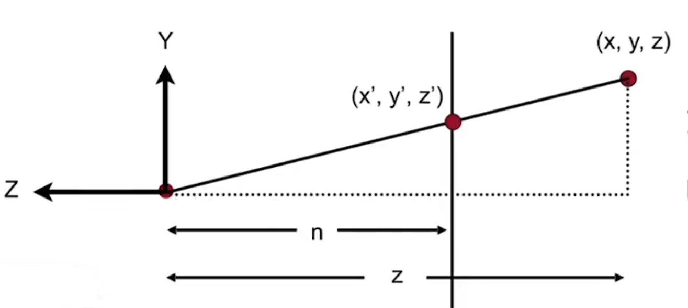

由上图可知（x，y对称图中只对y的变化进行考虑），对于坐标(x, y, z, 1)经过拉伸后，根据图中的相似三角形，可知，$x'=\frac{n}{z}x, y'=\frac{n}{z}y$，其中z未知，也就是变换后齐次坐标为$(\frac{n}{z}x, \frac{n}{z}y, ?, 1)$，不妨对该齐次坐标整体乘z可得到$(nx, ny, ?, z)$，也就是如下式子
$$
M_{persp->ortho}
\left[
\matrix{  x\\  y\\  z\\  1}
\right]
=
\left[
\matrix{  nx\\  ny\\  ?\\  z}
\right]
可得
M_{persp->ortho}=
\left[
\matrix{
n & 0 & 0 & 0 \\ 0 & n & 0 & 0 \\ ? & ? & ? & ? \\ 0 & 0 & 1 & 0
}
\right]
$$


下面考虑如何得到矩阵M~persp->ortho~ 的第三行参数，这时候就要用到上面提到的两个规定，根据规定①，可知若将齐次坐标(x,  y, n, 1)代如上式中可得
$$
\left[
\matrix{
n & 0 & 0 & 0 \\ 0 & n & 0 & 0 \\ ? & ? & ? & ? \\ 0 & 0 & 1 & 0
}
\right]
\left[
\matrix{x \\ y \\ n \\ 1}
\right]
=
\left[
\matrix{nx \\ ny \\ n^2 \\ n}
\right]
从该式可得第三行的前两个系数为0，并将后两个系数设为A和B\\
从而得出
M_{persp->ortho}=
\left[
\matrix{
n & 0 & 0 & 0 \\ 0 & n & 0 & 0 \\ 0 & 0 & A & B \\ 0 & 0 & 1 & 0
}
\right]
也就可知An+B=n^2
$$


同理，根据规定②，可知将齐次坐标(0, 0, f, 1)代入同样的式子可得
$$
\left[
\matrix{
n & 0 & 0 & 0 \\ 0 & n & 0 & 0 \\ 0 & 0 & A & B \\ 0 & 0 & 1 & 0
}
\right]
\left[
\matrix{0 \\ 0 \\ f \\ 1}
\right]
=
\left[
\matrix{0 \\ 0 \\ f^2 \\ f}
\right]
也就可知Af+B=f^2
$$
根据上面推导出的两个方程可得
$$
\left\{
\begin{array}{l}
        An+B=n^2 \\  
        Af+B=f^2
\end{array}
\right.
解二元一次方程组可解得
\left\{
\begin{array}{l}
	A=n+f\\
	B=-nf
\end{array}
\right.
\\
至此M_{persp->ortho}矩阵系数的推导完毕，M_{persp->ortho}=
\left[
\matrix{
n & 0 & 0 & 0 \\ 0 & n & 0 & 0 \\ 0 & 0 & n+f & -nf \\ 0 & 0 & 1 & 0
}
\right]
\\
根据以上所有推导可得M_{persp}=M_{ortho}M_{persp->ortho}
$$

## Lecture 05: Rasterization(Triangles)

### 1. Perspective Projection Params

定义透视投影视锥(frustum)的一些参数：Vertical Field of View(fovY)，Aspect ratio = width / height，如下图所示


下面通过fovY和Aspect ratio得出l, r, b, t，首先根据fovY和n求出t，自然得到b=-t，从而知道了整个面的高度为2t，又由于宽度为2r，于是$Aspect ratio = 2r / 2t = r / t$，便可知$r = t * aspect，l=-r$，整个过程考虑从侧面看，如下图


### 2. Viewport Transform（视口变换）

Rasterize == drawing onto the screen, Pixel(picture element缩写)

**Viewport Transform流程**：要将xy平面由[-1, 1]^3^（由透视投影或是正交投影得到） 转换到[0, width] x [0, height]，首先将长方体的长宽变成height和width（由于原本长度为2，故先除2再乘上width或是height），然后由于屏幕的左下角为坐标原点，而图像中心并不是显示在屏幕的左下角而是正中心，于是还应该加上一个偏移量将图形整体偏移，可知变换矩阵$M_{viewport} = \left[\matrix{\frac{width}{2} & 0 & 0 & \frac{width}{2} \\ 0 & \frac{height}{2} & 0 & \frac{height}{2} \\ 0 & 0 & 1 & 0 \\ 0 & 0 & 0 & 1}\right]$

### 3. Sampling a Function——discretize a function by sampling

inside函数，判断一个坐标是否在三角形内，用叉积的方式可以判断出，然后判断屏幕上每个像素点的中心，代码如下：

```cpp
for (int x = 0; x < xmax; ++ x) 
    for (int y = 0; y < ymax; ++ y) 
		image[x][y] = inside(tri, x + 0.5, y + 0.5)
```

上述代码的缺点在于，当三角形并不是占满整个屏幕时，扫描整个屏幕的像素点就显得有点浪费，可以求出三角形的Bounding Box（包围盒）后在Bounding Box，称为Axis-aligned bounding box(aabb，轴向包围盒)中扫描每个像素，如下图所示，当然还有许多加速光栅化的做法


但是，仅通过将在三角形内的像素点上色的办法并不能使得呈现的图形看着是三角形，这是由于采样率不够导致了采样结果的走样，如下图所示


通过Antialiasing（抗锯齿）能够得到真正的三角形

## Lecture 06: Rasterization(Antialiasing and Z-Buffering)

待补学：信号与系统的知识

### Sample Artifacts（走样）

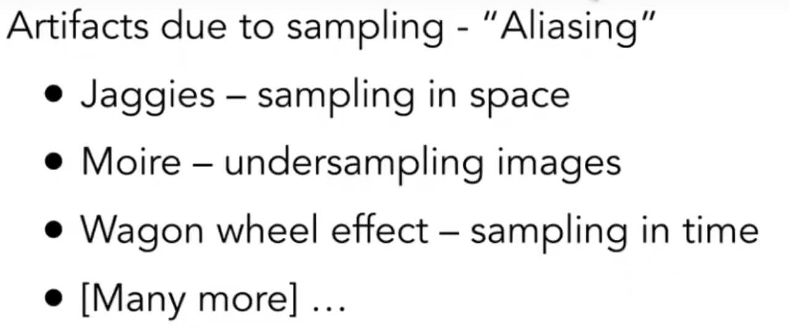

**产生artifacts的原因**：信号（函数）变化太快以至于采样跟不上变化的速度	

### Antialiasing

**Antialiasing**就是先进行Pre-Filter（模糊处理）再进行采样，**注意**不能先采样再filter，若先采样再filter，这种被成为**Blurred Aliasing**


#### **如何进行减少Aliasing Error？**

① Increase sampling rate ②Antialiasing：先对f(x, y)进行convolve再进行sample

### Antialiasing By Supersampling(MSAA)

### Z-Buffering(Lecture 07)

**Painter's Algorithm**：先画远处的事务，再画近处的事务，但对于一些远近关系不好判断的情况（你在我上，我在他上，他在你上）不好处理。

**Z-Buffer**：存储每个像素的z值，同时需要一个额外的buffer，frame buffer用于存储颜色，depth buffer(z-buffer)用于存储深度。**算法执行流程**：初始状态下，每个像素的深度被定义为∞/inf，在Rasterization的过程中根据深度更新zbuffer和framebuffer，伪代码如下

```CPP
memset(zbuffer, inf, sizeof zbuffer);
for (each triangle T)
   	for (each sample(x, y, z) in T)
        if (z < zbuffer[x][y])			//如果当前像素的深度更小，说明该像素应该覆盖原有的像素
            zbuffer[x][y] = z;			//更新深度
			framebuffer[x][y] = rgb;	//更新颜色	
		else	
            pass;						//否则不做操作
```


## Lecture 07: Shading 1(Illumination, Shading and Graphics Pieline)

### Blinn-Phong Reflection Model

着色(shading)具有局部性，shading != shadow

一些参数定义，$$\vec{v}$$表示观察者的方向，$$\vec{n}$$表示法线，$$\vec{l}$$表示光照方向，且都是单位向量


#### **Diffuse Reflection**


##### Lambert's cosine law


**漫反射公式**


#### Specular Reflection

当观察方向$$\vec{v}$$和镜面反射方向$$\vec{R}$$足够接近时，会产生高光

半程向量$$\vec{h}$$概念：$$\vec{l}$$和$$\vec{v}$$的角平分线所对应的向量，定义为$$\vec{h} = bisector(\vec{v}, \vec{l}) = \frac{\vec{v}+\vec{l}}{||\vec{v}+\vec{l}||}$$，当$$\vec{h}$$和$$\vec{n}$$接近时，也就说明$$\vec{v}$$和$$\vec{R}$$接近


注意到公式中的cos有个指数p，增大p可以减小高光，一般p使用100到200之间，下图可知当p合适时，夹角达到30到40度时，几乎就看不见高光


#### Ambient Reflection


#### Blinn-Phong Reflection

Ambient + Diffuse + Specular = Blinn-Phong Reflection，即如下公式


## Lecture 08: Shading 2(Shading, Pipeline and Texture Mapping)

#### Shading Frequencies

| Shading frequencies | Shading type |
| ------------------- | ------------ |
| Face                | Flat         |
| Vertex              | Gouraud      |
| Pixel               | Phong        |


顶点法线的定义：周围面的法向量的平均，既$$N_{v}=\frac{\sum_{i}N_{i}}{||\sum_{i}N_{i}||}$$，更好的方式是使用加权平均，权值为相邻三角形的面积


像素法线的定义：使用重心坐标插值法(Barycentric interpolation)，**注意所有法线求完后要进行归一化，使其成为单位向量**

#### Graphics(Real-time Rendering) Pipeline

图形（实时渲染）管线描述了一个过程：将三维场景转换到屏幕上的二维图像的过程


其中，shading的过程处于Vertex Processing(采用Gouraud模型时)和Fragment Processing（对像素进行着色）两个阶段，可以通过编写shader程序实现，以下是OpenGL着色语言GLSL的代码示例——在网站[Shadertoy](https://www.shadertoy.com/)上练习 


#### Texture Mapping

纹理就是用于定义在shading时每个点的一些属性，从而使得每个点的shading不完全相同。将一个二维的图像贴在三维物体的表面形成纹理，如何三维空间的三角形与纹理进行映射，主要有以下两种方法：①由艺术家来创作，相当于已知映射关系（对于我们来说） ② 自动化过程，重要的研究方向——参数化

###### **Visualization of Texture Coordinates**

纹理的坐标用(u, v)表示，u和v都处于[0, 1]的范围内


## Lecture 09: Shading 3(Texture Mapping cont.)

### Interpolation Across Triangles: Barycentric Coordinates

定义重心坐标为($$\alpha$$, $$\beta$$, $$\gamma$$)，有以下性质，当点在三角形内部时，三个坐标必须都是非负的，重心就是重心坐标为(1/3, 1/3, 1/3)时的情况


已知ABC和内的一点(x, y)的坐标求重心坐标——核心思想是利用叉乘求三角形面积


在**Assignment 2**中实现rasterize_triangle函数时，需要使用到插值来得到z_interpolated，并根据z_interpolated判断是否要更新z_buffer数组和frame_buffer数组，实现代码如下，对于其中w_reciprocal的计算还未完全理解清楚，主要用于[透视矫正插值](https://zhuanlan.zhihu.com/p/144331875)

```cpp
if (insideTriangle(x + 0.5, y + 0.5, t.v)) {
    //使用重心坐标计算插值
    auto tup = computeBarycentric2D(x, y, t.v);
    float alpha, beta, gamma;
    std::tie(alpha, beta, gamma) = tup;
    //z_interpolated要乘以w_reciprocal的原因是为了进行透视校正插值
    //即在投影变换后保持深度和顶点属性的正确比例关系
    float w_reciprocal = 1.0 / (alpha / v[0].w() + beta / v[1].w() + gamma / v[2].w());
    float z_interpolated = alpha * v[0].z() / v[0].w() + beta * v[1].z() / v[1].w() + gamma * v[2].z() / v[2].w();
    z_interpolated *= w_reciprocal;
    if (z_interpolated < depth_buf[get_index(x, y)]) {
        depth_buf[get_index(x, y)] = z_interpolated;
        set_pixel(Eigen::Vector3f(x, y, z_interpolated), t.getColor());
    }
}
```

### Applying for Texture Mapping 

运用纹理伪代码如下，比较简单

```cpp
for each rasterized screen sample(x, y):
	(u, v) = evalutate texture coordinate at(x, y)
    texcolor = texture.sample(u, v)
    set sample's color to texcolor
```

### Bilinear interpolation（双线性插值）

双线性插值用于根据一个未知点周围的4个已知点来估计未知点的坐标，插值函数定义为lerp(x, v~0~, v~1~) = v~0~ + x(v~1~ - v~0~)，具体流程为：①选择水平的两条边根据s分别进行插值得出u~0~和u~1~ ②根据t、u~0~和u~1~计算插值


### Bicubic（双三次插值）

为减少Bilinear出现的模糊和锯齿，使用Bicubic能够保持边缘信息和平滑度，但也导致计算量更大，大致流程和Bilinear相似，区别在于：①Bicubic选取的是未知点周围的16个点 ② Bicubic使用的插值函数为三次多项式

### Mipmap——还未完全理解

Mipmap用于近似的正方形范围查询(fast, approximate, square)，将图片按照分辨率分成多层，级别是log级别。由于Mipmap都是近似，且并不是每个像素所对应的纹理都是规则的正方形，所以会出现**Overblur**的情况

如何计算当前像素位于纹理的第几层？


对于位于D层和D+1层之间的像素，可以先在D和D+1层进行Bilinear Interpolation，再将结果进行一次插值，也就是Trilinear Interpolation，这样就可以实现平滑的过渡


### Anisotropic Filter（各向异性过滤）

**各向异性含义**：在不同的方向表现互不相同

用于**部分解决**三线性插值的问题，提高3D图形质量的方法，它可以处理当视角变化导致物体表面倾斜时的纹理错误，它可以让远处和倾斜的表面的纹理更加清晰和真实

各向异性过滤允许对矩形进行快速的范围查询，而不再约束于正方形，但是对于斜向的图形仍具有缺陷，为了解决各向异性过滤的缺陷，于是有了**EWA filtering**

### Cube Map

一种使用立方体的六个面作为地图形状的环境贴图方法。环境被投影到立方体的侧面并存储为六个正方形纹理，或展开为单个纹理的六个区域。 

### Bump Mapping（凹凸贴图）

### Displacement Mapping（位移贴图）

## Lecture 10: Geometry 1(introduction)

表示几何的方式分为两种：**implict**和**explicit**，根据实际情况进行选择

隐式表示：定义一个函数f(x, y, z)，当有(a, b, c)满足f(a, b, c) = 0则表明(a, b, c)在该面上，隐式表示不容易找出一个面上的所有点，但是容易判断一个点和面的位置关系。

显示表示：直接给出或是通过参数映射的方式给出，已知(u, v)可以得到(x, y, z)，但在判断点和面的位置关系时比较困难

### Constructive Solid Geometry(implicit)


### Distance Functions(implicit)


### Level Set Methods(implicit)


### Fractals(implicit) ——分形

有点类似于递归，每个图形又是由多个小图形组成的


### Point Clound(explicit)

表示空间中的很多点，当点的密度足够大时就会呈现一个面的情况，密度低时不容易画出面


### Polygon Mesh(explicit)

几乎是最广泛应用的显示表示


## Lecture 11: Geometry 2(Curves and Surfaces)


### Bézier Curves（贝塞尔曲线）

定义一些控制点去控制某一条曲线


贝塞尔曲线的一些性质：①时刻0一定在起点，时刻1一定在终点 ②切线斜率一定 ③做仿射变换后曲线不变 ④曲线一定在控制点所构成的凸包内


####  de Casteljau Algorithm 

递归算法，若当前有n个点n-1条线段，取当前为某时刻t，将每条线段分成t和1-t，也就产生了n-1个点，连接n-1个点产生n-2条线段，一直递归到只剩一个点。遍历所有的时刻，所有点汇聚成的曲线就是贝塞尔曲线


####  Algebraic Formula 			


### Piecewise Bézier Curves

逐段定义贝塞尔曲线，一般用每4个控制点定义一段贝塞尔曲线

两种连续性：**C0连续**和**C1连续**，可以类比成函数连续和一阶导数连续，


### Bézier Surfaces

## Lecture 12: Geometry 3

### Loop Subdivision

将一个三角形拆分成更多三角形，细分完后再进行调整，但只能用于三角形面


### Catmull-Clark Subdivision 

可用于各种面，一些概念定义：①奇异点：度不等于4的点 ②非四边形面：边数不等于4的多边形 ③每次细分新增的奇异点数为细分前非四边形面的数量，且仅在第一次细分时会新增

**细分前**：

**细分后**：

### Mesh Simplification

减少模型终三角形的数量以提高效率，在某些时刻没必要使用非常复杂的模型


#### Edge Collapsing 

用于进行网格简化，如何进行边坍缩，对于每条边进行坍缩后都会产生一个误差值（二次度量误差），每次选择最小的误差值的边进行坍缩，坍缩完后更新其他边的误差值，可以容易想到用优先队列或者是堆来实现


### Shadow Mapping

执行步骤：①从光源看向场景，记录深度 ②从场景相机出发渲染点，对于每个点都重新投影回光源，比较当前深度与之前记录的深度是否一致，若一致则能看见，否则就被遮挡

## Lecture 13: Ray Tracing 1(Whitted-style Ray Tracing)

光线追踪的三个假设：①光线是直线传播的 ②两束光线不会产生碰撞 ③光线一定会从光源出发最终到达人眼（也可理解为眼睛能发出感知光线——可逆性）

**Whitted-style Ray Tracing**也称为**Recursive Ray Tracing**，一些光线定义如下图


### Ray-Surface Intersection

光线定义：从一个起始点**o**出发，沿着**d**方向，表示为$r(t) = o + td, 0\le t <\infty$

#### Ray Intersection With Sphere 

根据光线方程和球面方程，将光线方程代入球面方程解得t即可得到光线是否于球面得位置关系


#### Ray Intersection With Implicit Surface 

根据光线方程和隐式表面函数，将光线方程代入函数解得t即可得到光线与表面的交点


#### Ray Intersection With Triangle 

判断光线和三角形是否相交，可以分成以下两步：①计算光线和平面的交点（平面用点法式确定）②判断交点是否在三角形内


##### Möller Trumbore Algorithm 

使用该算法可以用于快速计算三维空间中的射线和三角形是否相交的算法，本质就是解一个线性方程组

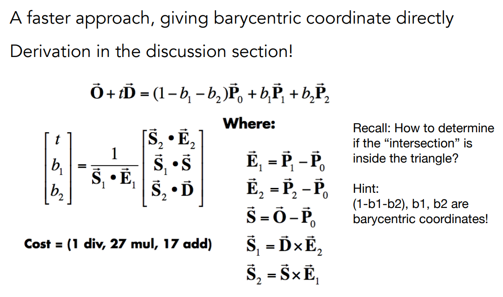

### Axis-Aligned Bounding Box (AABB)  

由于对每个像素都进行光线追踪的计算量十分大，采用AABB可以有效优化计算量，要检测的物体是由一个长方体盒子包裹，而长方体盒子可以由三对面包围构成

要计算光线和AABB的交点，可以计算光线对于每一对面相交时对应的t~min~和t~max~，最后取t~min~中的最大记为t~enter~以及t~max~中的最小记为t~exit~


当t产生负值时，主要有以下几种情况：①若t~exit~小于0，则说明AABB在光线的背后，没有交点 ②若t~enter~小于0但是t~exit~大于等于0，则说明光线在AABB内部，有交点

综上所述，可得当且仅当(iff) t~enter~ < t~exit~ && t~exit~ >= 0时，光线和AABB有交点，在计算t的

时候可以只用分量进行计算从而减少计算量


## Lecture 14: Ray Tracing 2(Acceleration & Radiometry)

### Spatial Partitions  

#### Uniform Spatial Partitions 

首先进行预处理，实现流程如下：①找到包围盒 ②创建均匀网格 ③存储每个有物体覆盖的对象


预处理完后，可以进行光线交点的判断，流程大致是：遍历每一个网格，判断网格中的物体是否与光线相交。但是当网格过多时可能会导致效率低下，通常网格参数C取到经验值27在三维空间中。这种方式也会出现 “Teapot in a stadium” 问题，即很大空间中有个小物体，导致计算效率很低。

#### KD-Tree

常见空间划分有：**Oct-Tree（八叉树）,KD-Tree,BSP-Tree**

KD-Tree需要先预处理建立一颗二叉树，每次可以根究轴进行划分，然后就可以对KD-Tree进行遍历，每次判断光线与当前结点的左右孩子是否有交点，若有交点且孩子是叶子结点，则计算光线与节点内存储的物体信息是否有交点，否则若有交点且不是叶子结点，则递归遍历

KD-Tree可能会出现一个物体即在左子树又在右子树的情况

### Object Partition

#### Bounding Volume Hierarchy(BVH)

首先进行BVH的建立（预处理），实现流程如下：①找到包围盒 ②将当前集合划分成两个子集 ③重新计算每个子集的包围盒 ④一直递归进行，直至必要时暂停 ⑤在每个叶子结点中存储物体信息

划分时启发式原则：①选择最长的轴进行划分 ②尽量保证每个子集的个数相对均匀 ③当一个结点包含比较少的元素时停止划分

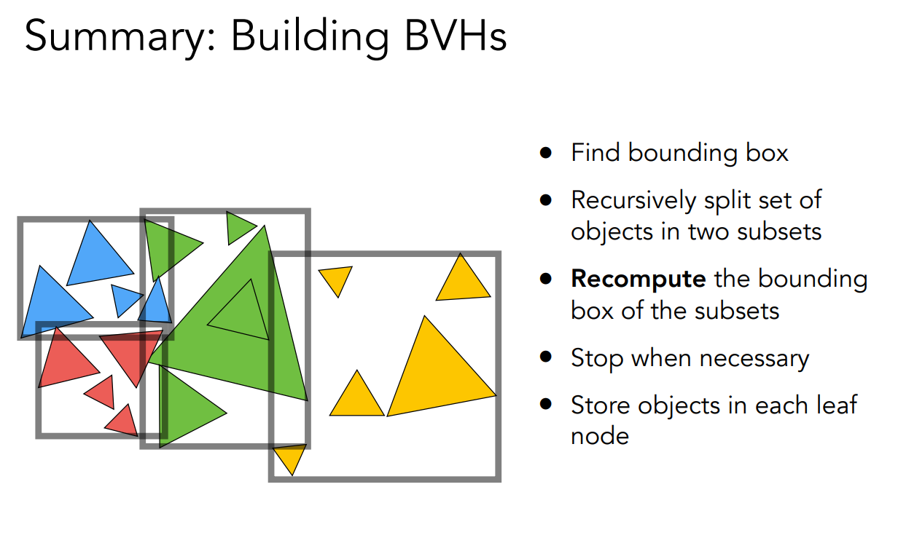

预处理完后，可以进行**BVH Traversal**，实现伪代码如下：

```
Intersect(Ray ray, BVH node) {
    if (ray misses node.bbox) return ;
    
    if (node is a leaf node) 
    	test intersection with all objs;
    	return closest intersection;
    
    hit1 = Intersect(ray, node.child1);
    hit2 = Intersect(ray, node.child2);
    
    return the closer of hit1, hit2;
}
```


#### [Surface Area Heuristic(SAH)](http://15462.courses.cs.cmu.edu/fall2015/lecture/acceleration/slide_021)

当遇到以下情况时，使用最简单的BVH性能并不是很好，所以要考虑另外一种方式


可以根据子包围盒的表面积与父包围盒的表面积计算出光线会射到子包围盒的概率（表面积之比），遍历每种划分计算每种划分的cost代价函数，记录下代价最下的一种划分作为本次划分

代价函数定义：$C=C_{trac}+p_AN_AC_A+p_BN_BC_B$，其中$C_{trav}$是遍历当前节点的代价，$C_A和C_B$是当前节点的子节点A和B的代价函数，$N_A和N_B$是当前节点的子节点A和B的物体的个数，$p_A和p_B$是光线射到子节点A和B的概率

对于n个物体在k维空间共有$k(n-1)$种划分方式，对于每一个维度，n个物体都有n-1种划分

划分方式：将所有物体划分到B个buckets中（B通常小于32），伪代码如下：

```cpp
for each axis: x, y, z:
	initialize buckets;
    for each primitive p in node:
		b = compute_bucket(p.centroid);
        b.bbox.union(p.bbox);
        b.prim_count++;
	for each of the B-1 possible partitioning planes evaluate SAH
Execute lowest cost partioning found(or make node a leaf)
```

Troublesome cases：①所有的物体都有相同的重心 ②所有的物体都同属一个包围盒

Solution：①将所有物体都划分到同一个节点中 ②按照数量均等分给两个子节点


### Radiometry（辐射度量学）

定义一系列方法和单位用于描述真实的光照，一些新的术语：Radiant flux,intensity,irradiance,radiance

#### Radiant Energy and Flux(Power)

Radiant Energy表示能量，用Q表示，单位为J(Joule，焦耳)，Radiant flux(power)表示单位时间的能量，$\Phi\equiv\frac{dQ}{dt} [W = Watt][lm = lumen]^*$

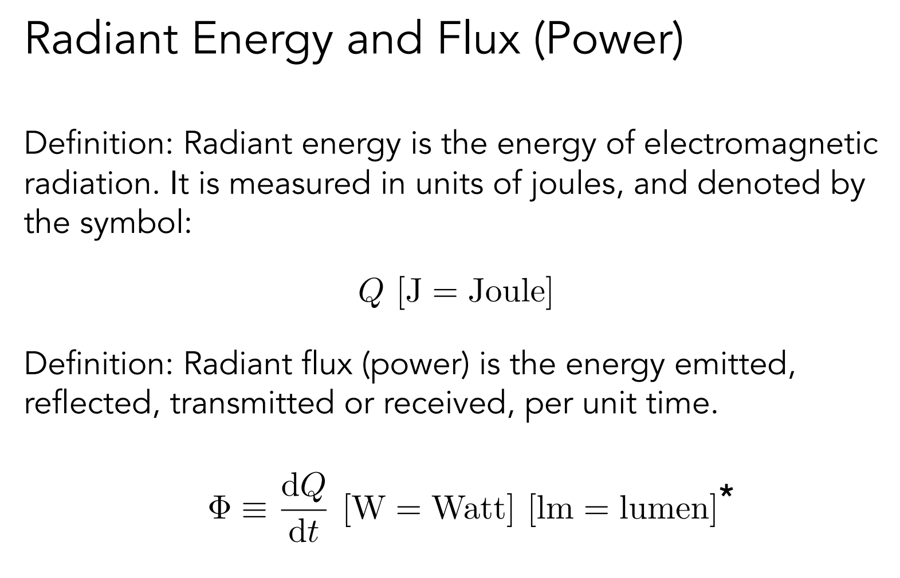

#### Radiant Intensity

Intensity即每个立体角上对应的能量，定义：$I(\omega)\equiv \frac{d\Phi}{d\omega}[\frac{W}{sr}][\frac{lm}{sr}=cd=candela]$


立体角定义：$\omega=\frac{A}{r^2}$，整个球面的立体角为$4\pi$


可由球面坐标系推导得出，根据球面坐标系可知$dA=r^2sin\theta d\theta d\phi$，由立体角定义可得$d\omega=\frac{dA}{r^2}=sin\theta d\theta d\phi$，将该微元在整个球面积分得$\Omega=\int_{s^2} d\omega=\int_0^{2\pi}\int_0^{\pi}sin\theta d\theta d\phi=4\pi$


又根据Intensity定义可得$\Phi=\int_{s^2}Id\omega=4\pi I$，从而推出当光线均匀发射时，$I=\frac{\Phi}{4\pi}$

#### Irradiance

irradiance即单位面积上的能量，定义为：$E(x)\equiv\frac{d\Phi(x)}{dA}[\frac{W}{m^2}][\frac{lm}{m^2}=lux]$


irradiance计算时必须是光线与面垂直的面积，若不垂直则需要根据**Lambert's Cosine Law**进行计算，如图所示


#### Radiance 

radiance描述光在环境中的分布的基本场量，定义为: $L(p, \omega)\equiv\frac{d^2\Phi(p, \omega)}{d\omega dAcos\theta}[\frac{W}{srm^2}][\frac{cd}{m^2}=\frac{lm}{srm^2}=nit(尼特)]$


##### Incident Radiance 

Incident Radiance是指每个单位立体角到达表面的irradiance


##### Exiting Radiance 

Exiting Radiance是指每个单位投影面积离开表面的intensity


#### Irradiance vs Radiance

可以理解为irradiance是四面八方到达表面的单位投影面积的能量，而radiance则是从某个特定角度来的irradiance，将所有方向的radiance积分后就可以得到irradiance，即$E(p)=\int_{H^2}L_{i}(p,\omega)cos\theta d\omega$


#### Conclusion

| 物理量（中文仅作参考）        | 符号表示 | 公式                                                         | 单位             |
| ----------------------------- | -------- | ------------------------------------------------------------ | ---------------- |
| Radiant Energy（辐射能）      | $Q$      | 无                                                           | $焦耳J$          |
| Radiant flux （辐射通量）     | $\Phi$   | $\Phi\equiv\frac{dQ}{dt}$                                    | $瓦特W / 流明lm$ |
| Angles（角度）                | $\theta$ | $\theta=\frac{l}{r}$                                         | $弧度rad$        |
| Solid Angles（立体角）        | $\Omega$ | $\Omega=\frac{A}{r^2}$                                       | $球面角度sr$     |
| Radiant Intensity（辐射强度） | $I$      | $I(\omega)\equiv\frac{d\Phi}{d\omega}$                       | $烛光cd$         |
| Irradiance（辐照度）          | $E$      | $E(x)\equiv \frac{d\Phi(x)}{dA}$                             | $照度lux$        |
| Radiance（辐射）              | $L$      | $L(p,\omega)\equiv\frac{d^2\Phi(p,\omega)}{d\omega dAcos\theta}$ | $尼特nit$        |

## Lecture 15: Ray Tracing 3(Light Transport & Global Illumination)

### Bidirectional Reflectance Distribution Function (BRDF) 

BRDF用于描述表面入射光和反射光关系，由**Lecture 14**中的Radiance和Irradiance之间的关系可得$dE(\omega_i)=L(\omega_i)cos\theta_i d\omega_i$，BRDF被定义为指定方向的反射光和入射光的比例关系，表达式为$f(\omega_i\rightarrow\omega_r)=\frac{dL_r(\omega_r)}{dE_i(\omega_i)}=\frac{dL_r(\omega_r)}{L_i(\omega_i)cos\theta_i d\omega_i}[\frac{1}{sr}]$


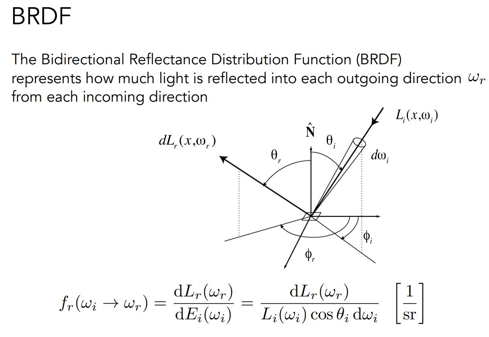

对于一个反射方向$\omega_r$的Radiance，可以由所有方向来的Irradiance的积分得到即$L_r(p,\omega_r)=\int_{H^2}f_r(p,\omega_i\rightarrow\omega_r)L_i(p,\omega_i)cos\theta_id\omega_i$，**注意有些方向的Irradiance可能是经过一次或多次反射的Radiance，又由于物体本身可能会发出光源，于是可以得到渲染方程(Rendering Equation)**，设物体在p点处发出的光在反射方向$\omega_o$处的Radiance为$L_e(p,\omega_o)$，于是可得渲染方程为$L_o(p,\omega_o)=L_e(p,\omega_o)+\int_{\Omega+}L_i(p,\omega_i)f_r(p,\omega_i\,\omega_o)(n\cdot\omega_i)d\omega_i$，其中cos由法向量和入射光线的点积代替，积分区域由H^2^变成了$\Omega+$是由于只需要计算球面的上半部分，下半部分对于反射的Radiance没有贡献

#### Rendering Equation as Integral Equation 

一些式子的替换内容省略过多，对于式子中的K的由来并未解释，主要是一种理解其目的


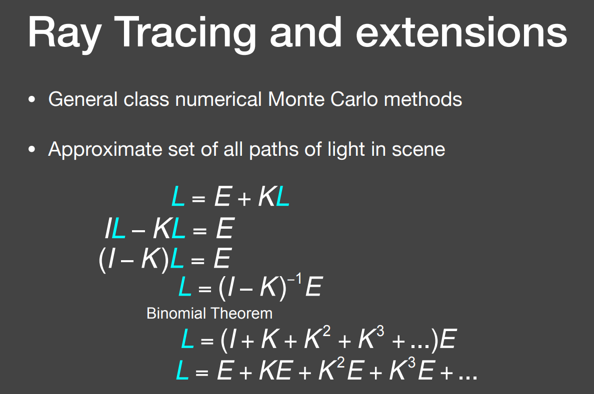

推导所得（类似泰勒展开）的L即是**Global Illumination**，简单来说全局光照就是直接光照+间接光照，当间接反射的次数越来越多时，对效果图几乎没有影响，有点类似于级数收敛

#### [拓展文章：《基于物理着色：BRDF》](https://zhuanlan.zhihu.com/p/21376124)

## Lecture 16: Ray Tracing 4(Monte Carlo Path Tracing)

### Monte Carlo Integration（蒙特卡洛积分）

由于在编程时很难求出定积分的解析解，需要通过采样的方式来近似估计定积分的值，对于$\int_a^bf(x)dx，若X_i\sim p(x)，则有\int_a^bf(x)dx=\frac{1}{N}\sum\limits_{i=i}^{N}\frac{f(X_i)}{p(X_i)}$，可以求得$E(\frac{1}{N}\sum\limits_{i=i}^{N}\frac{f(X_i)}{p(X_i)})=\int_a^bf(x)dx$，说明该方法的期望就是要求的定积分的值

### Path Tracing

由于**Whitted-Style Ray Tracing**会在漫反射表面停止反射从而使得光线追踪效果不正确，但是渲染方程是正确的，想要解出渲染方程主要涉及到：①解出球面上的积分 ②递归执行

假设观察的点自身不会发出光，也就是渲染方程可以简化成$L_o(p,\omega_o)=\int_{\Omega+}L_i(p,\omega_i)f_r(p,\omega_i\,\omega_o)(n\cdot\omega_i)d\omega_i$

化简后就可以用蒙特卡洛积分进行求解，将$L_i(p,\omega_i)f_r(p,\omega_i\,\omega_o)(n\cdot\omega_i)$看成一个整体，pdf选用最简单的方式——在球面上均匀采样，即$p(\omega_i)=\frac{1}{2\pi}$，于是就有$L_o(p,\omega_o)=\int_{\Omega+}L_i(p,\omega_i)f_r(p,\omega_i\,\omega_o)(n\cdot\omega_i)d\omega_i\approx\frac{1}{N}\sum\limits_{i=1}^N\frac{L_i(p,\omega_i)f_r(p,\omega_i\,\omega_o)(n\cdot\omega_i)}{p(\omega_i)}$

根据式子可以得到着色伪代码如下：

```CPP
shade(p, wo)
    Randomly choose N directions wi~pdf
    Lo = 0.0
    for each wi
        Trace a ray r(p, wi)
        if ray r hit the light
            Lo += (1 / N) * L_i * f_r * cosine / pdf(wi)
        else if ray r hit an object at q
            Lo += (1 / N) * shade(q, -wi) * f_r * cosine / pdf(wi)
    return Lo
```

但这样并没有完全结束，考虑一个点p处会有N个方向也就会打到N个点上，以此递归是指数级别的必然会导致栈空间的不足，除非N是小于等于1，所以考虑每次只往一个方向，但是只选择一个方向会产生噪声，只需要对于一个像素采样SPP(samples per pixel)次并计算平均值即可

仍然存在的问题：递归会一直进行不会停止，可以使用俄罗斯轮盘赌(Russian Roulette)的方式根据概率停止递归

使用RR后，每次的shade需要除以当前的概率P，可行性在于按照这样计算期望可以达到与原来一样的效果


于是可得以下伪代码：

```cpp
shade(p, wo)
	Manually specify a probability P_RR
	Randomly select ksi in a uniform dist. in [0, 1]
	If (ksi > P_RR) return 0.0;

	Randomly choose ONE direction wi~pdf(w)
	Trace a ray r(p, wi)
	If ray r hit the light
		Return L_i * f_r * cosine / pdf(wi) / P_RR
	Else If ray r hit an object at q
		Return shade(q, -wi) * f_r * cosine / pdf(wi) / P_RR
```

课堂问题：采用RR算法的shade期望弹射次数是多少？

假设RR每次停止递归的概率为p，则弹射x次可得概率为p^x^，x的取值为1, 2 ...

于是弹射次数的期望$E(X)=\sum\limits_{n=1}^{\infin}n*p^n=p\sum\limits_{n=1}^{\infin}n*p^{n-1}=\frac{p}{(1-p)^2}$

#### Sampling the Light 

当光源面积很小时，上述方法十分浪费光线，因为有很大的概率发出的光线不会打到光源上（如果是在球面上均匀采样的话），此时可以考虑在光源进行均匀采样

在光源上采用就涉及到渲染方程中的微元之间的转换，根据推导可得$d\omega=\frac{dAcos\theta^{'}}{||x^{'}-x||^2}$，渲染方程就可以变成$L_o(p,\omega_o)=\int_{\Omega+}L_i(p,\omega_i)f_r(p,\omega_i\,\omega_o)(n\cdot\omega_i)d\omega_i=\int_{A}L_i(p,\omega_i)f_r(p,\omega_i\,\omega_o)\frac{cos\theta cos\theta^{'}}{||x^{'}-x||^2}dA$，使用蒙特卡洛积分求解即可，概率密度函数pdf选择$\frac{1}{A}$


考虑radiance来自两部分：①直接来自光源不需要进行RR ②其他间接反射而来使用RR，同时要考虑着色点和光源之间是否存在遮挡，最终伪代码如下：

```cpp
shade(p, wo)
	# Contribution from the light source.
	L_dir = 0.0
	Uniformly sample the light at x’ (pdf_light = 1 / A)
    Shoot a ray from p to x’
	If the ray is not blocked in the middle
    	L_dir = L_i * f_r * cos θ * cos θ’ / |x’ - p|^2 / pdf_light
	# Contribution from other reflectors.
	L_indir = 0.0
    Test Russian Roulette with probability P_RR
    Uniformly sample the hemisphere toward wi (pdf_hemi = 1 / 2pi)
    Trace a ray r(p, wi)
	If ray r hit a non-emitting object at q
		L_indir = shade(q, -wi) * f_r * cos θ / pdf_hemi / P_RR
	Return L_dir + L_indir
```

## Lecture 17: Materials and Appearances

### Material == BRDF 

材质决定了BRDF函数的值，常见的材质有： Diffuse / Lambertian，Glossy material

#### Diffuse / Lambertian

漫反射材质，光线会被反射到四周。漫反射渲染方程为$L_o(\omega_o)=\int_{H^2}f_rL_i(\omega_i)cos\theta_id\omega_i=f_rL_i\int_{H^2}cos\theta_id\omega_i=f_rL_i\int_0^{2\pi}d\phi\int_0^{\pi}cos\theta sin\theta d\theta=\pi f_r L_i$，由于反射能量等于入射的能量即$L_o=L_i$，可以求得$f_r=\frac{L_o}{\pi L_i}=\frac{1}{\pi}$，再引入反射率的概念$\rho$，取值为0-1使得物体能接受不同颜色的BRDF，即$f_r=\frac{\rho}{\pi}$


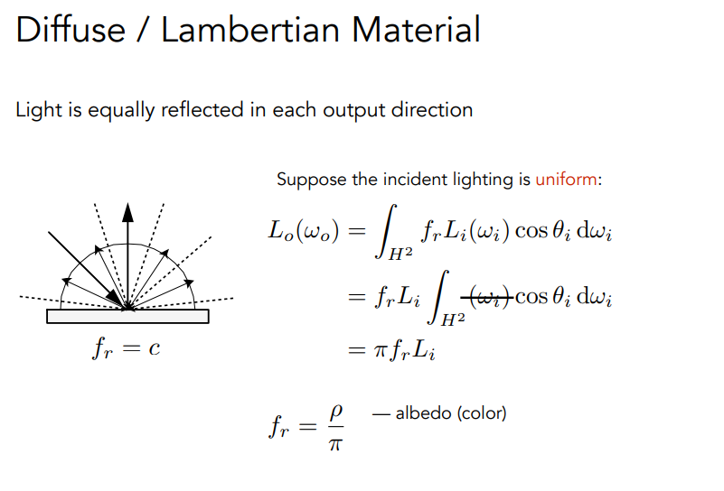

#### Glossy material


#### Ideal reflective / refractive material (BSDF=BRDF+BTDF) 

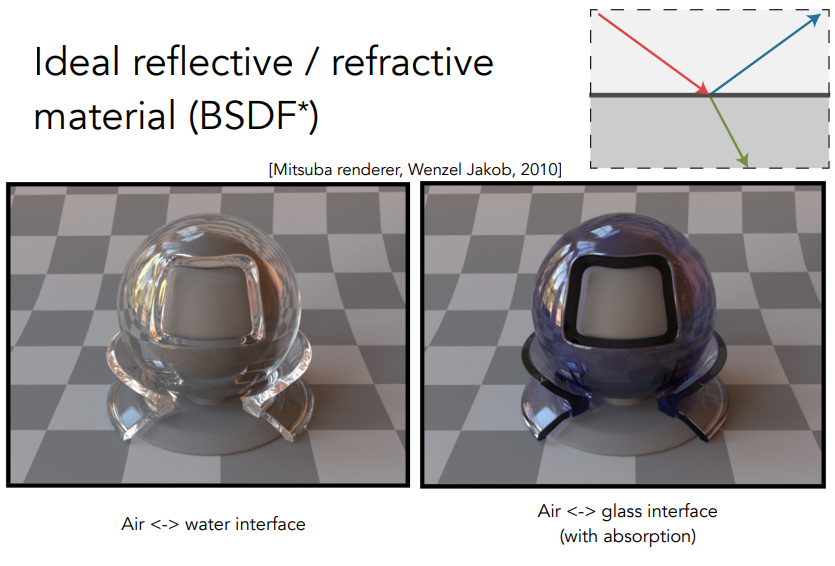

### Perfect Specular Reflection 

根据入射光方向和法线方向计算出出射方向，利用平行四边形法则，推导如下$\omega_i+\omega_o=2cos\theta \vec{n}=2(\omega_i \cdot \vec{n})\vec{n}$，由此可得$\omega_o=-\omega_i+2(\omega_i \cdot \vec{n})\vec{n}$


### Law of Refraction 

#### Snell’s Law 

折射率$\eta$，根据与法线夹角$\theta$和折射率可根据入射方向计算出折射方向


根据式子$\eta_isin\theta_i=\eta_tsin\theta_t$可得，$cos\theta_t=\sqrt{1-(\frac{\eta_isin\theta_i}{\eta_t}^2)}=\sqrt{1-(\frac{\eta_i}{\eta_t})^2(1-cos^2\theta_i)}$，可知当$\frac{\eta_i}{\eta_t}$大于1时，根号下的数小于0无意义，即可认为物体不会发生折射，这种现象称为**全反射**（人在水底往上看，只能看到一小块区域，这就是由于全反射，被称为 **Snell’s Window / Circle** ）


### Fresnel Reflection / Term （菲涅尔项）

当入射光线与物体法线垂直（入射角越接近垂直）时，反射更明显。当入射光线与物体法线平行（入射角越接近0°）时，折射量更明显。


#### Fresnel Term — Formulae 


### Microfacet Material 

从远处看，看到的是材质。从近处看，看到的是几何。（材质和几何存在关系）

材质就可以用微表面的法线分布来表示。例如，对于glossy材质，其微表面的法线分布比较聚集均匀，对于diffuse材质，其微表面的法线分布比较分散不均匀。


Grazing Angle（掠射角度）是指几乎与面平行即几乎与法线垂直的入射方向，接近这个角度时就会发生shadowing-masking（微表面发生自遮挡自投影的现象），需要使用shadowing-masking term进行修正

微表面模型的BRDF计算公式$f(i,o)=\frac{F(i,h)G(i,o,h)D(h)}{4(n,i)(n,o)}$，其中F(i,h)为菲涅尔项用于正确计算能量，G(i,o,h)为发生shadowing-masking时用于修正的系数，D(h)是计算有多少微表面的法向量符合能使得入射方向$\omega_i$经过反射得到出射方向$\omega_o$的法向量h


### Isotropic / Anisotropic Materials (BRDFs) 


### Properties of BRDFs 

- Non-negativity（非负性）：$f_r(\omega_i\rightarrow \omega_r)\ge 0$
- Linearity（线性）：$ L_r(p, \omega_r) = \int_{H^2}f_r(p, \omega_i \rightarrow \omega_r)L_i(p, \omega_i) cos \theta_i d\omega_i $
- Reciprocity principle（可逆性）：$f_r(\omega_i \rightarrow \omega_o)=f_r(\omega_o \rightarrow \omega_i)$
- Energy conservation（能量守恒）：$ {\forall} \omega_r \int_{H^2}f_r(\omega_i \rightarrow \omega_r)cos\theta_i d\omega_i \le 1$
- 对于各项同性材质：$f_r(\theta_i,\phi_i;\theta_r,\phi_r)=f_r(\theta_i,\theta_r,\phi_r-\phi_i)$，根据可逆性可得$f_r(\theta_i,\theta_r,\phi_r-\phi_i)=f_r(\theta_i,\theta_r,\phi_i-\phi_r)=f_r(\theta_i,\theta_r,|\phi_r-\phi_i|)$

### Measuring BRDFs

对于使用Schlick's approximation求得的BRDF与实际测量得到的BRDF常有较大的差距


可以使用专门的仪器测量并存储下来（类似查表），方法大致为：

```CPP
foreach outgoing direction wo
	move light to illuminate surface with a thin beam from wo
	for each incoming direction wi
		move sensor to be at direction wi from surface
		measure incident radiance
```

## Lecture 18: Advanced Topics in Rendering——了解前沿技术

### Bidirectional path tracing (BDPT)  

对于大部分光都是由漫反射形成的场景中效果好，例如在下图中的场景，所有的物体都是由单一光源经过漫反射后照亮的，如果采用普通的Path Tracing会导致miss概率大，而采用BDPT就可以提高质量


BDPT的做法大致是：从光源射出一个sub-path，从相机射出一个sub-path，然后连接两个sub-path的终点


### Metropolis light transport (MLT) 

利用统计学中马尔科夫链( Markov Chain Monte Carlo (MCMC) )概念根据一条已知路径作为种子生成与该路径相似的一些路径，适用于复杂场景的光线追踪，但缺点是局部性效果可能不好且无法预估渲染时间


### Photon mapping

光子映射实现步骤主要为：①从光源射出光线直到遇到漫反射表面停止 ②从相机射出光线直到遇到漫反射表面停止 ③计算局部密度( local density estimation ) 对任意一个着色点取周围的确定光子数并通过其占据的面积计算密度 


这种方法是**biased**的，这是由于局部密度计算公式是$\frac{dN}{dA}$，但是由极限可知当且仅当$ \displaystyle\lim_{\Delta A \rightarrow 0}\frac{\Delta N}{\Delta A}=\frac{dN}{dA}$，但是只有在光子数量接近无穷多时即分布更为密集时，取一定的光子数才能够达到面积无穷小

但是这种方法是**consistent**的，biased和consistent理解如下：

- Biased == blurry 
- Consistent == not blurry with infinite #samples 

### Vertex connection and merging (VCM) 

这是一种结合BDPT和Photon Mapping的方法，如果BDPT中两边打出的光线不能连接，利用光子映射将一定范围的光线做融合，提高光线利用率。 


### Instant radiosity (VPL / many light methods) 

实时辐射度算法核心思想：弹射到其他物体的光线，当成该物体发光继续Path Tracing，渲染速度较快，对于漫反射场景效果好，但是无法处理glossy材质且会产生白点（由于light sample和立体角的转化要除以距离平方但距离过小时会导致结果无穷大）


### Advanced Appearance Modeling 

#### Non-surface models 

##### Participating media（散射/参与介质）

光线在传播过程中会发生两件事：①被吸收 ②被散射，穿过不同的参与材质会产生不同的散射

根据Phase Function（相位函数）来决定散射方向和散射均匀程度（类似于BRDF）


[拓展文章：《描述次表面散射：参与介质、体绘制、辐射传输方程》](https://zhuanlan.zhihu.com/p/508586030#1%20%E4%BD%93%E7%BB%98%E5%88%B6%EF%BC%88Volume%20Rendering%EF%BC%89)

##### Hair / fur / fiber (BCSDF)  

**Kajiya-Kay Model**认为头发只有反射， **Marschner Model**认为头发是一个半透明的玻璃圆柱体，有反射也有折射 ，将毛发理解为一个圆柱，会有反射(R)，也有先折射在反射再折射出去(TRT)，也有先折射进入再折射出去(TT)


动物毛发和人类毛发会有不同，动物毛发中的髓质( Medulla )更大，导致其折射效果更加明显，为此提出了  **Double Cylinder Model** 


##### Granular material（颗粒材质）

从近处看表面是由许多颗粒构成的，例如用沙子做成的城堡近处看是一粒粒细小颗粒

#### Surface models 

##### Translucent material (BSSRDF，次表面散射）

BSSRDF是BRDF的扩展，BRDF仅从某一个固定点反射，而BSSRDF会从一个区域中的多个点反射，渲染方程也会不同$L(x_o,\omega_o)=\int_A \int_{H^2} S(x_i, \omega_i, x_o, \omega_o) L_i(x_i, \omega_i) cos\theta_i d\omega_i dA$


使用**Dipole Approximation**来模拟次表面散射

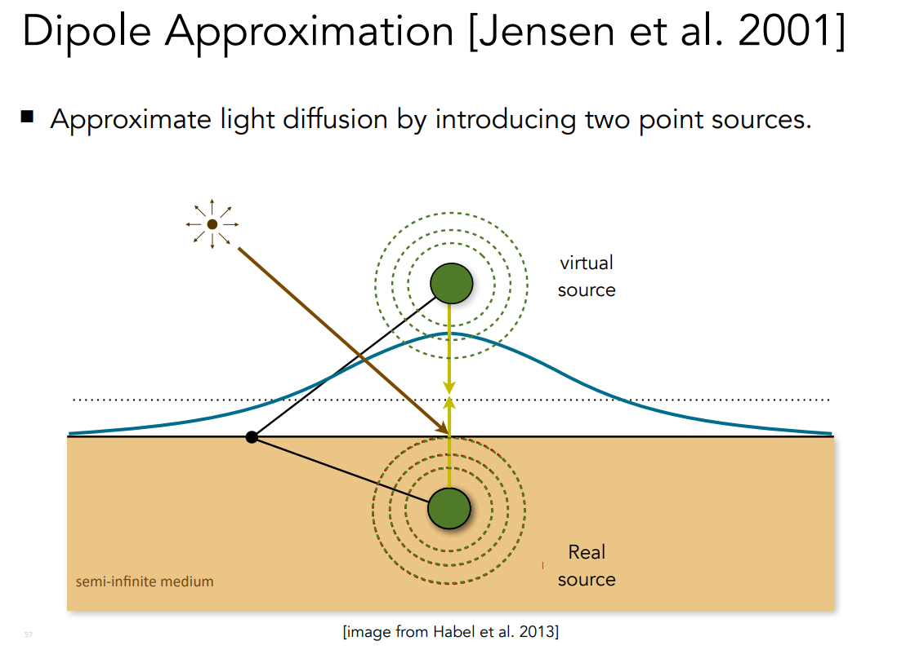 

##### Cloth 

渲染衣服的三种主要方式：①  将衣物当作表面，根据不同的织法使用不同的BRDF  ②  将衣服当做散射介质，根据单根纤维的特性与分布来构建散射参数  ③ 直接渲染每一根纤维，但计算量爆炸

##### Detailed material (non-statistical BRDF) 

现实生活中的一些表面往往会有一些瑕疵，而不是十分的完美，对于我们已有的法线分布并没有一些细节上的内容


对于微表面材质，渲染花费时间较长，主要原因在于：微表面被认为一个微小的镜面，从摄像机打到镜面上根据法线计算出反射方向，但这个反射光线很难打到光源上，从光源打出同理


解决办法：考虑一个像素覆盖许多微表面，将这一个范围内微表面的法线分布计算出来替代原有的微表面，被称为p-NDF，其中p是patch，对于不同的贴图当然也会得到不同的p-NDF


但引入细节后，仅仅使用几何光学来解释就已经不够了，这时候就要涉及到波动光学（很复杂）

#### Procedural appearance 

使用noise function（噪声函数）来计算细节，不需要真正生成复杂的材质，直接通过查询进行计算

工业界使用Houdini专门来做程序化生成材质

## Lecture 19: Cameras. Lenses and Light Fields

### Field of View (FOV) 

视场是相机可见的范围，计算公式$fov=2arctan\frac{h}{2f}$，对于不同的设备由于成像的sensor高度不同，所以要展示相同的图像就需要调整focal length（焦距）来得到相同的fov


### Exposure 

曝光的一些性质：

- $H=T * E$
- $Exposure=time*irradiance$
- **Exposure time (T) ​**由快门打开时间控制
- **Irradiance (E)** 由透镜的孔径（光圈大小）和焦距控制
- **Aperture size** 表示光圈大小用F数来表示，数越小表示光圈越大，光圈大小影响**Depth of Field（景深）**
- **Shutter speed** 表示快门速度即快门打开的时间，快门速度过大可能导致高速运动的物体产生模糊
- **ISO gain **表示感光度，用于改变传感器成像的数值提高或降低曝光度，通俗理解就是在成像后乘以一个系数，但可能导致噪声被同样放大导致噪声明显

### F-Number (F-Stop) 

记为F/N或FN，其中N为一个F数，$N=\frac{f}{D}$即F数为焦距除以光圈直径

### Thin Lens Approximation（透镜）

通常不只使用一片透镜而是使用透镜组从而可以达到动态调整焦距的效果

- **Focal Point（焦点）**：透镜对于平行光会集中在一个点
- 物距($z_o$)，相距($z_i$)和焦距($f$)之间的关系：$\frac{1}{f}=\frac{1}{z_i}+\frac{1}{z_o}$，可以使用两个相似三角形推导得到如下图


### Depth of Field（景深）

相机对于焦点前后的一段距离内成像较为清晰，这段距离就是**景深**，超出这个范围的图像则比较模糊

景深计算方式如下，课程中未给出推导


### Circle of Confusion(CoC)

在焦点前后，光线开始聚集和扩散，点的影象变成模糊的，形成一个扩大的圆，这个圆就叫做**Circle of Confusion(CoC)**，计算方法如下图


可以得CoC和F数之间的关系$C=A\frac{|z_s-z_i|}{z_i}=\frac{f}{N}\frac{|z_s-z_i|}{z_i}$，其中A就是透镜直径D

### Ray Tracing for Defocus Blur (Thin Lens) 

实现透镜上的光线追踪步骤：

准备步骤：①选择sensor size，lens focal length和aperture size ②定义物距$z_o $ ③根据公式计算出相距$z_i $

渲染流程：①在成像平面上选择一个像素$x^{\prime}$ ②在透镜上随机选择$x^{\prime \prime}$ ③根据透镜原理可知连接$x^{\prime}$和透镜中心并延长交subject plane于$x^{\prime\prime\prime}$，可知从$x^{\prime\prime\prime}$到$x^{\prime\prime}$的光线经过透镜后会打在$x^{\prime}$④计算从$x^{\prime\prime}$到$x^{\prime\prime\prime}$的radiance


### Light Field / Lumigraph

#### The Plenoptic Function（全光函数）

我们不需要关注是由什么物体发出的光，只需要知道光的怎么样的即由全光函数得到

不同的全光函数：

- $P(\theta,\phi)$：可以表示所有我们可以看到的场景（黑白），即 **Grayscale snapshot** 
- $P(\theta,\phi,\lambda)$：加入参数$\lambda$表示波长（颜色的本质就是波长）使所有看到的场景有颜色，即 **Color snapshot** 
- $P(\theta,\phi,\lambda,t)$：加入参数t表示时间，表示在不同时间看到的场景，即 **movie**
- $P(\theta,\phi,\lambda,t,V_x,V_y,V_z)$：加入(x,y,z)坐标表示在任意位置看的场景，即  **Holographic movie** 

视觉被定义为七个参数的全光函数

光场是全光函数的一部分即$P(\theta,\phi,V_x,V_y,V_z)$表示任意位置任意方向的光的物理量

光的物理量定义为位置信息$(u, v)$+方向信息$(\theta, \phi)$，也可以通过定义两个平行平面的位置来确定光的位置和方向


#### Light Field Camera 

光场相机最大的特点就是可以拍完照后再进行光圈大小和焦距的调整，作用就是将Irrandiance分成radiance

由于记录了光线的radiance，可以通过观察某个方向的光线，也就能达到一张照片多个方向观看，但这样导致的后果就是由于需要多个传感器才能存储一个像素的信息导致分辨率比较低，成本高

## Lecture 20: Color and Perception

### Physical Basis of Color

图形学中仅关注波长在400-700nm的可见光

**Spectral Power Distribution (SPD，谱功率密度)** 用于描述光在不同波长上的分布，SPD具有线性性质

但是人只关注看到的颜色（颜色是人的感觉与光无关），并不关注SPD，所以对于同样的颜色可以由不同的光谱得到

### Biological Basis of Color 

人眼的生理结构如下，其中晶状体就是透镜，视网膜就是成像平面(sensor)，视网膜中存在许多感光细胞


感光细胞分为Rods（视杆细胞）和Cones（视锥细胞）分别用于感知光照强度和颜色

Cones又根据对不同波长的敏感程度分为SML三种


### Tristimulus Theory of Color 

对响应曲线与SPD进行积分得到S, M, L三个数才是看到的颜色


### Metamerism（同色异谱） 

同样的颜色可以拥有不同的光谱，但是积分结果得到的SML相同，所以具有相同的颜色

### Color Reproduction / Matching 

#### Additive Color 

通过修改RGB的值得到想要的颜色，由于是加色系统，可以通过不同颜色的线性组合匹配想要得到的颜色


但有时，仅通过修改RGB的值无法得到想要的颜色，可以考虑给目标颜色加上一个颜色得到当前有的颜色，相当于是当前颜色减去这个颜色可以得到目标颜色，也就是说RGB的值可能是负数，由此诞生了**CIE RGB系统**

#### CIE RGB Color Matching Fuctions

对于任意一个波长，知道RGB三种颜色各自需要多少原始光可以得到该波长

对于下图中的积分，$s(\lambda)$表示由SPD求得该波长下的光照强度，$\bar{r}(\lambda)$则表示匹配函数


### Standard Color Spaces

RGB系统全称是Standardized RGB(sRGB)，最广泛使用的颜色系统，其Gamut（色域）有限

**Gamut（色域）**表示一个颜色空间所有可能表示的颜色，不同颜色系统的色域不同

#### CIE XYZ 

由人们自己定义而非由实验得出的一种颜色系统，人们定义了CIE XYZ的匹配函数，其中Y表示亮度（人对绿色的感知最明显）


为了将XYZ可视化，对XYZ进行归一化得到xyz，可得$x+y+z = 1$，从而固定Y使得xy为XZ的函数，便可以得到下图中的色域


#### HSV Color Space (Hue-Saturation-Value) 

HSV是一种颜色系统，H表示色调，S表示饱和度，V表示明度


#### CIELAB Space (AKA $L^*a^*b^*$) 

通过三个轴控制亮度和互补色，白的互补色是黑，红的互补色是绿，黄的互补色是蓝

#### CMYK: A Subtractive Color Space 

CMYK是一种减色系统由靛蓝(C)，品红(M)，黄(Y)混合成其他颜色，虽然CMY可以合成出黑色(K)但是由于应用在印刷中需要考虑到成本的问题，黑色墨水成本便宜，故添加上黑色

## Lecture 21: Animation——what

### Keyframe Animation 

关键帧技术，以前由原画画出关键帧后由助手求出关键帧之间的渐变帧，现在可以通过插值的方法直接求得


### Physical Simulation 

#### Mass Spring System

质点弹簧系统即一系列由弹簧连接的质点，可以仿真出比较真实的效果

- 理想弹簧，设质点a，b由弹簧连接，则在a点收到的往b方向的力为$\bold{f_{a\rightarrow b}}=k_s(\bold{b}-\bold{a})$，同理可得b点收到的往a方向的力为$\bold{f_{b\rightarrow a}}=-\bold{f_{a\rightarrow b}}$，其中$k_s$是弹簧系数
- 根据胡克定律$F=-k_sx$，x为被拉伸的长度，由于不存在长度为0的弹簧，于是需要考虑弹簧的长度即$\bold{f_{a\rightarrow b}}=k_s\frac{(\bold{b}-\bold{a})}{||\bold{b}-\bold{a}||}(||\bold{b}-\bold{a}||-l)$，其中l为rest length即弹簧的长度
- 若不考虑阻力，弹簧会一直震动（动能和势能不断转换），于是需要加入阻尼力使得其能够停下，记$x$的导数为$\dot{x}$，考虑加入阻尼力$\bold{f_b}=-k_d\bold{\dot{b}}$表示应用在b点上的阻尼力
- 仍然存在问题，加入阻尼力后的系统无法考虑弹簧内部的力，需要进行完善，考虑弹簧内部的阻尼力与质点之间的相对速度有关系$\bold{f_b}=-k_d\frac{\bold{b}-\bold{a}}{||\bold{b}-\bold{a}||}\cdot (\bold{\dot{b}}-\bold{\dot{a}}) \cdot \frac{\bold{b}-\bold{a}}{||\bold{b}-\bold{a}||}$，可以看出$\frac{\bold{b}-\bold{a}}{||\bold{b}-\bold{a}||}\cdot (\bold{\dot{b}}-\bold{\dot{a}})$就是相对速度的差值在a到b方向上的投影是一个标量


#### Structures from Springs 

将弹簧系统组织成各种结构，如下图


用这样的弹簧系统来模拟一块布无法达到很真实的效果，例如当拉住布的对角会导致形状变化（无法抵抗切变力）与真实的布不相同的情况，于是考虑在每个方块中加入对角线的弹簧


但这样仅仅解决了对角线上的问题，无法解决沿着弹簧竖向对着的情况，考虑在每个质点和其间隔一个质点的质点连一个弹簧(skip connection)


这样就可以得到比较真实的效果，当然也可以使用 **FEM (Finite Element Method)** 方法来代替质点弹簧系统

### Particle Systems 

粒子在每一帧的生成步骤：①根据需要创建新粒子 ②计算每个粒子的力 ③更新粒子的位置和速度 ④根据需要删除死亡的粒子 ⑤渲染粒子

粒子之间的作用力：重力，电磁力，摩擦力，空气阻力，粘度，墙体，容器，物体等

#### Simulated Flocking as an ODE 

将鸟群看成一堆粒子，每一只鸟就是一个粒子，因此具有三个性质：

- attraction（吸引性）：每个粒子会被其他粒子吸引
- repulsion（排斥性）：每个粒子不会靠其他粒子太近
- alignment（方向性）：每个粒子的大致方向一致


### Forward Kinematics 

关节被分为三类：① 可以绕着关节2维的旋转 ② 可以绕着关节3维的旋转  ③ 可以拉长一部分的关节 

通过参数计算出p点的坐标，被称为**正向运动学**


### Inverse Kinematics 

由于正向运动学操作不够直观，因此有了**逆向运动学**，即通过p来控制参数


但这种方式可能导致：①解不唯一 ②无解，所以在实现时并不是使用数学的方法求得参数而是通过随机化方法（梯度下降等）来求得参数

### Rigging

在模型上添加控制点，人们能够调整控制点使得模型做出不同的动作

对于两个控制点，可以通过插值的方法求得控制点之间的位置，这种方法称为**Blend Shapes**

### Motion Capture

通过控制点去调整模型的动作往往是比较复杂的，可以通过动作捕捉的方式来得到控制点的变化

优点：① 可以快速获得大量数据 ② 比较真实 

缺点：① 复杂且成本高 ② 捕获的动作不一定符合要求需要后期调整

捕获方法：① optical（光学） ② Magnetic（磁力）③ Mechanical（机械）

### The Production Pipeline  

动画制作管线


## Lecture 22: Animation cont.——how

### Single Particle Simulation 

通过速度场获得单个粒子的速度参数$v(x,t)$，通过计算一阶常微分方程$\frac{dx}{dt}=\dot{x}=v(x,t)$解得粒子的位置x，可以通过数值方法（离散方法）进行求解

### Euler’s Method 

欧拉方法也成为前向欧拉或显示欧拉方法，对时间进行离散化利用欧拉方法求得每一个时刻的位置和速度$x^{t+\Delta t} = x^t + \Delta t \dot{x}^t，\dot{x}^{t+\Delta t} = \dot{x}^t + \Delta t\ddot{x}^t$，该方法是一种简单的迭代的方法比较常用但是非常不准确且不稳定

欧拉方法的**Errors**是由$\Delta t$的大小所导致的，若$\Delta t$过大可能导致得到的路径与正确路径差异越来越大（正反馈）


欧拉方法的**Instability**， 具体来说，当$\Delta t$取得过大时，欧拉方法可能会导致数值解迅速偏离真实解，无法正确反映物理现象，且这种现象十分常见


几种 Combating Instability 的方法：

-  Midpoint method / Modified Euler 中点法
-  Adaptive step size 自适应步长
-  Implicit methods 隐式欧拉方法
-  Runge-Kutta Families 龙格-库塔方法
-  Position-based / Verlet integration 

#### Midpoint Method 

中点法步骤：① 在初始点使用欧拉方法求出下一时刻的位置a  ② 取初始点和a的中点b ③ 使用b的速度求出初始点的下一时刻的位置c

完整公式表达$x^{t+\Delta t}=x^t+\frac{\Delta t}{2}(\dot{x}^t+\dot{x}^{x+\Delta t}), \dot{x}^{t+\Delta t}=\dot{x}^t+\Delta t\ddot{x}^t$，从而可得$x^{t+\Delta t}=x^t+\Delta t \dot{x}^t+\frac{(\Delta t)^2}{2}\ddot{x}^t$，可以发现类似于泰勒展开因为多了一个二次项所以更加精确


#### Adaptive step size

自适应步长步骤：①计算$\Delta t$下的欧拉方法 ② 计算$\frac{\Delta t}{2}$下的欧拉方法 ③比较两者，若差异较大则将$\Delta t$减半后重新计算 


#### Implicit methods

与显示欧拉方法不同的是隐式欧拉方法使用的是下一时刻的速度和加速度

$x^{t+\Delta t} = x^t + \Delta t \dot{x}^{t+\Delta t}，\dot{x}^{t+\Delta t} = \dot{x}^t + \Delta t\ddot{x}^{t+\Delta t}$，联立后解出结果（假设下一时刻的加速度已知）


#### Runge-Kutta Families（龙格-库塔方法）

该方法也被称为RK4，课程中只给出了式子，需要补充数值分析的知识可以理解其推导

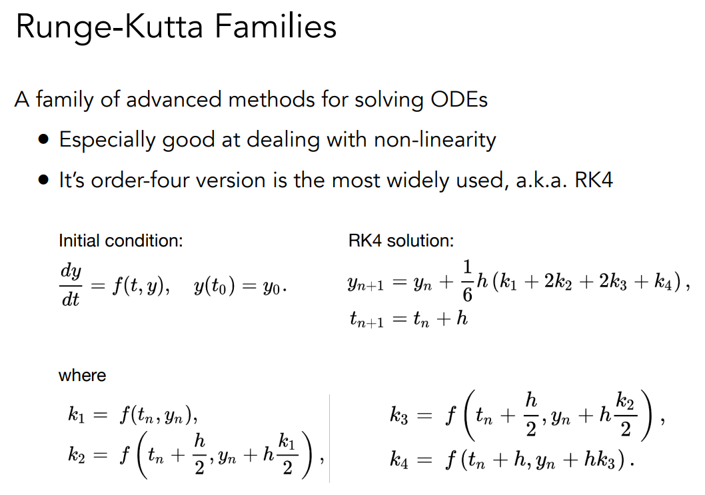

#### Position-Based / Verlet Integration 

不基于物理的方法，通过调整某些位置使得满足模型中的一些特定性质


### How to determine / quantize “stability”? ——《数值分析》

通过研究**Local truncation error（局部截断误差）**和**total accumulated error（总体累计误差）**来确定稳定性

对于一阶隐式欧拉方法其局部阶段误差为$O(h^2)$，全局截断误差为$O(h)$

​	

### Rigid Body Simulation 

刚体不会发生形变，通过求得下面的参数通过上面粒子模拟的方法计算出任意时刻的位置 


### Fluid Simulation 

流体模拟的一些设定：① 水是由刚体小球组成 ② 水不能被压缩 

实现思路：①  通过获取任意时刻小球的分布位置来获取小球单位面积的密度 ② 如果密度如果发生改变（不同于平静的水面），就通过通过改变小球的位置来修正位置，让水总有一个趋于平静的趋势 ③  通过加入能量损失让水最终停下来 

#### Eulerian vs. Lagrangian 

Lagrangian又称质点法，Eulerian又称网格法


#### Material Point Method (MPM）

将网格法和质点法进行融合的方法就是**Material Point Method** 

实现思路大致是：① 每一个粒子都带有物质属性 ② 使用网格法进行数值积分 ③ 将粒子的属性转换到网格中更新后再属性转化回粒子中

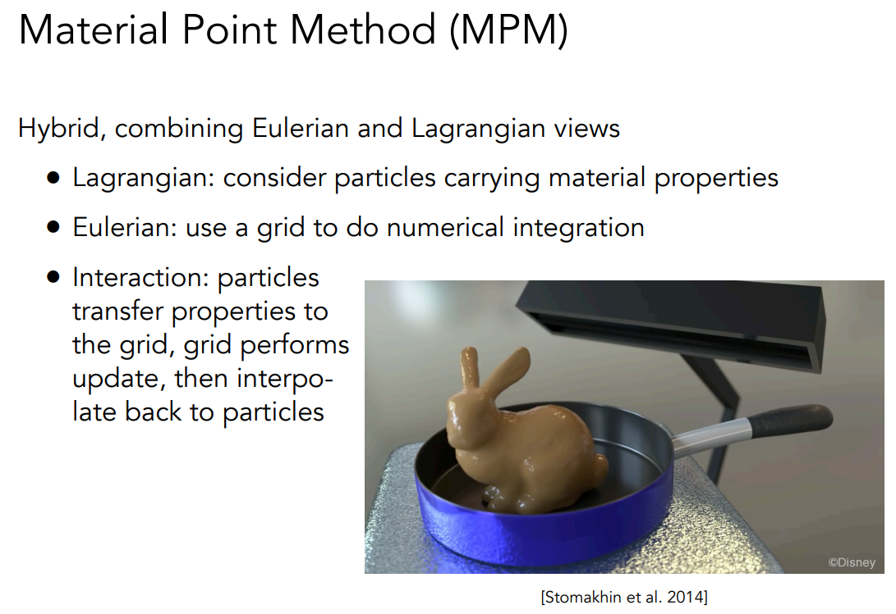

## 结语

至此，完成games101的学习，虽然还有一些知识点云里雾里，但有非常多的收获，完结撒花！！！