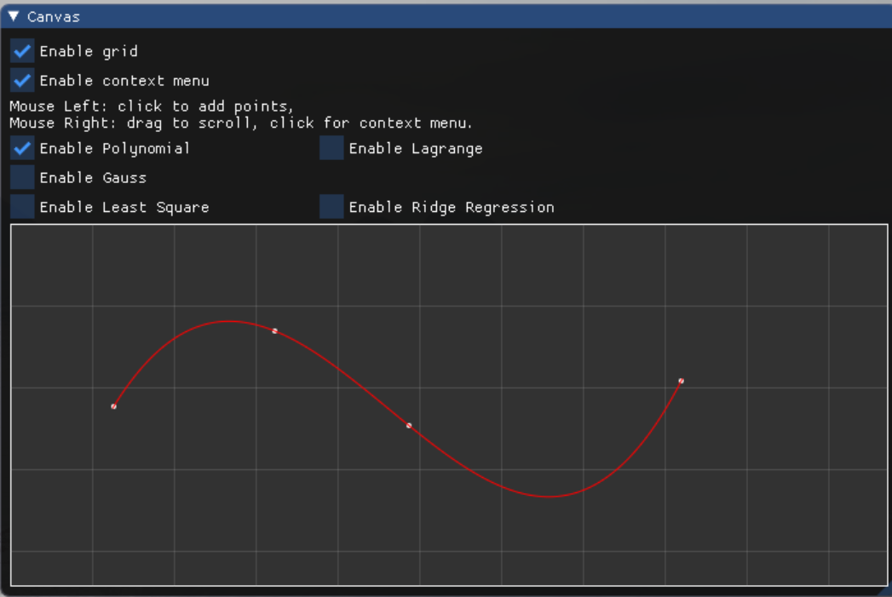
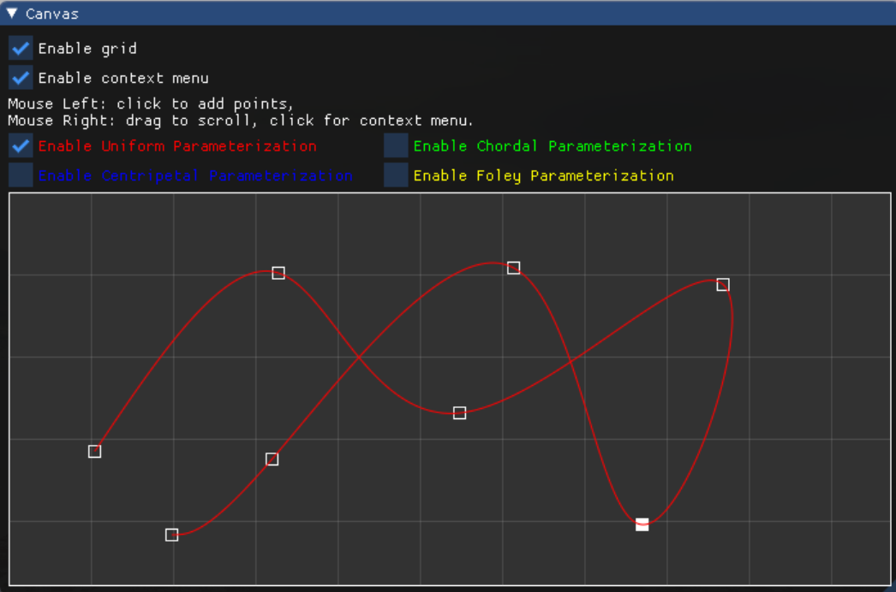

# Homeworks

## homework 1

本次作业分别实现了不同的拟合方法包括：幂基函数线性组合插值、拉格朗日插值、高斯基函数插值、固定幂最小二乘法和岭回归

1. 幂基函数线性组合插值，幂函数线性组合插值结果$p(x)=\sum\limits_{i=0}^ny_i x^i$

   ```cpp
   // 多项式插值法
   float Polynomial(float x, const std::vector<Ubpa::pointf2>& points)
   {
   	int n = points.size();
   	Eigen::MatrixXf A(n, n);
   	Eigen::VectorXf b(n);
   
   	for (int i = 0; i < n; i++)
   	{
   		b(i) = points[i][1];
   		float val = 1.0f;
   		for (int j = 0; j < n; j++)
   		{
   			A(i, j) = val;
   			val *= points[i][0];
   		}
   	}
   	
   	// Ax = b, x = A^(-1)b
   	Eigen::VectorXf coeffs = A.inverse() * b;
   
   	float result = 0.0f, val = 1.0f;
   	for (int i = 0; i < n; i++)		
   	{
   		result += coeffs(i) * val;
   		val *= x;
   	}
   	return result;
   }
   ```

   实现插值结果如下：

   

2. 拉格朗日插值，多项式基函数为$l_i(x)=\frac{\prod_{j \neq i}(x-x_j)}{\prod_{j \neq i}(x_i - x_j)}$，拉格朗日插值多项式表示为$p(x)=\sum\limits_{i=0}^ny_il_i(x)$

   ```cpp
   // 拉格朗日插值法
   float Lagrange(float x, const std::vector<Ubpa::pointf2>& points)
   {
   	int n = points.size();
   	float result = 0.0f;
   	for (int i = 0; i < n; i++)
   	{
   		// 拉格朗日基函数的分子和分母
   		float up = 1.0f, down = 1.0f;
   		for (int j = 0; j < n; j++)
   		{
   			if (i != j)
   			{
   				up *= (x - points[j][0]);
   				down *= (points[i][0] - points[j][0]);
   			}
   		}
   		result += points[i][1] * up / down;
   	}
   	return result;
   }
   ```

   实现插值结果如下（与幂函数线性组合插值类似）：

   

3. 高斯基函数插值，高斯基函数$g_{\mu,\sigma}=\frac{1}{\sqrt{2\pi}}e^{-\frac{(x-\mu)^2}{2\sigma^2}}$，从而得到RBF函数$f(x)=b_0+\sum\limits_{i=1}^nb_ig_i(x)$

   ```cpp
   // 高斯基函数插值
   float Gauss(float x, std::vector<Ubpa::pointf2> points, const float& sigma)
   {
   	// 由于高斯基函数插值有一个首项即有n+1个未知数，但目前只有n个点即n个方程，需要添加一个约束条件用于求出首项
   	points.push_back({ (points.front()[0] + points.back()[0]) / 2, (points.front()[1] + points.back()[1]) / 2 });
   	int n = points.size();
   
   	// 求解Gx=y，G为系数矩阵
   	Eigen::MatrixXf G(n, n);
   	for (int i = 0; i < n; i++)
   	{
   		float val = 1.0f;
   		for (int j = 0; j < n; j++)
   		{
   			G(i, j) = val;
   			val = std::exp(-(points[i][0] - points[j][0]) * (points[i][0] - points[j][0]) / (2 * sigma * sigma));
   		}
   	}
   	Eigen::VectorXf y(n);
   	for (int i = 0; i < n; i++) y(i) = points[i][1];
   
   	// Gx = y, x = G^(-1)y
   	Eigen::VectorXf coffees = G.inverse() * y;
   
   	// 利用插值出的系数计算在x点出的y值
   	float result = coffees(0), val = std::exp(-(x - points[0][0]) * (x - points[0][0]) / (2 * sigma * sigma));
   	for (int i = 1; i < n; i++)
   	{
   		result += coffees(i) * val;
   		val = std::exp(-(x - points[i][0]) * (x - points[i][0]) / (2 * sigma * sigma));
   	}
   
   	return result;
   }
   ```

   实现插值结果如下：

   

4. 固定幂最小二乘法，根据最小二乘法求解得$\alpha=(X^TX)^{-1}X^TY$

   ```cpp
   // 固定幂基函数最小二乘拟合
   float Least_Square(float x, const std::vector<Ubpa::pointf2> points)
   {
   	int n = points.size(), m = 4;
   
   	Eigen::MatrixXf X(n, m + 1);
   	for (int i = 0; i < n; i++)
   	{
   		float val = 1.0f;
   		for (int j = 0; j < m + 1; j++)
   		{
   			X(i, j) = val;
   			val *= points[i][0];
   		}
   	}
   
   	Eigen::VectorXf Y(n);
   	for (int i = 0; i < n; i++) Y(i) = points[i][1];
   
   	Eigen::VectorXf coffees = (X.transpose() * X).inverse() * X.transpose() * Y;
   
   	float result = 0.0f, val = 1.0f;
   	for (int i = 0; i < m + 1; i++)
   	{
   		result += coffees(i) * val;
   		val *= x;
   	}
   
   	return result;
   }
   ```

   实现拟合结果如下：

   

5. 岭回归，加入正则项并用最小二乘法解得$\alpha=(X^TX+\lambda I)^{-1}X^TY$

   ```cpp
   // 岭回归
   float Ridge_Regression(float x, const std::vector<Ubpa::pointf2> points)
   {
   	int n = points.size(), m = 4;
       float lam = 2.0;
   
   	Eigen::MatrixXf X(n, m + 1);
   	for (int i = 0; i < n; i++)
   	{
   		float val = 1.0f;
   		for (int j = 0; j < m + 1; j++)
   		{
   			X(i, j) = val;
   			val *= points[i][0];
   		}
   	}
   
   	Eigen::VectorXf Y(n);
   	for (int i = 0; i < n; i++) Y(i) = points[i][1];
   
   	Eigen::VectorXf coffees = (X.transpose() * X + lam * Eigen::MatrixXf::Identity(m + 1, m + 1)).inverse() * X.transpose() * Y;
   
   	float result = 0.0f, val = 1.0f;
   	for (int i = 0; i < m + 1; i++)
   	{
   		result += coffees(i) * val;
   		val *= x;
   	}
   
   	return result;
   }
   ```


​		实现拟合结果如下：


6. 五种方法对比效果图（红色为幂函数线性组合插值，绿色为拉格朗日插值，蓝色为高斯基函数插值，黄色为固定幂最小二乘法拟合，橙色为岭回归拟合）


## homework 2

本次作业实现了RBF神经网络拟合数据，使用cpp调用python接口，RBF神经网络模型和训练由pytorch实现

1. RBF神经网络结构，神经网络共有一个隐藏层，使用高斯函数作为激活函数：


2. 实现RBF神经网络模型，实现代码如下：

   ```python
   class GaussKernel(nn.Module):
       def __init__(self):
           super(GaussKernel, self).__init__()
           self.coefficient = 1 / np.sqrt(2 * np.pi)
   
       def forward(self, x):
           return self.coefficient * torch.exp(-0.5 * x * x)
   
   
   class RBFNet(nn.Module):
       def __init__(self, params_number):
           super(RBFNet, self).__init__()
   
           self.params_number = params_number
           
           # 输入层->隐层
           self.kernel = GaussKernel()
           self.a = nn.Parameter(torch.ones(self.params_number), requires_grad=True)
           self.b = nn.Parameter(torch.ones(self.params_number), requires_grad=True)
           
           # 隐层->输出层
           self.linear = nn.Linear(params_number, 1, bias=True)
   		
           # 随机生成初始化参数
           self.a.data.normal_(0, 0.2)
           self.b.data.normal_(0, 0.2)
           self.linear.weight.data.normal_(0, 0.2)
   
       def forward(self, x):
           g = self.kernel(self.a * x + self.b)
   
           return self.linear(g)
   ```

3. 实现RBF神经网络训练类，实现代码如下：

   ```python
   class RBFTraining:
       def __init__(self, **kwargs):
           self.span = kwargs.get('span', 8)
           self.lr = kwargs.get('lr', 0.01)
           self.max_epoch = kwargs.get('max_epoch', 500)
           self.epsilon = kwargs.get('epsilon', 1e-6)
           self.model = RBFNet(self.span)
           self.datas = {}
           # 采用Adam优化器
           self.optimizer = optim.Adam(self.model.parameters(), lr=self.lr)
           self.loss_fun = nn.MSELoss()
           self.last_loss = np.nan
   
       def train(self):
           for epoch in range(self.max_epoch):
               for x in self.datas:
                   y = self.datas[x]
                   x_tensor = torch.tensor([x])
                   y_tensor = torch.tensor([y])
   
                   self.optimizer.zero_grad()
                   y_predict = self.model(x_tensor)
                   loss = self.loss_fun(y_predict, y_tensor)
                   loss.backward()
                   self.optimizer.step()
   
                   print("[Epoch: {:>4}] loss = {:>.9}".format(epoch + 1, loss.item()))
                   if loss.item() < self.epsilon:
                       break
   
               self.last_loss = loss.item()
               print(" [*] Training finished!")
   ```

4. cpp调用python接口函数，注意由于cpp中的点坐标值较大，如果使用高斯函数作业激活函数会导致激活结果为0从而导致输出结果都为Linear层的bias，所以需要对输入的点进行等比例缩放。实现代码如下：

   ```python
   def training(x, y, x_predict, span=8, lr=0.01, max_epoch=500, epsilon=1e-6):
       trainer = RBFTraining(span=span, lr=lr, max_epoch=max_epoch, epsilon=epsilon)
   
       scale = 1000
       for i in range(len(x)):
           trainer.datas[float(x[i]) / scale] = float(y[i]) / scale
       
       trainer.train()
   
       # 使用训练好的模型预测结果
       y_predict = []
       for i in range(len(x_predict)):
           x_tensor = torch.tensor([float(x_predict[i]) / scale])
           y_predict.append(trainer.model(x_tensor).item() * scale)
   
       return y_predict
   ```

5. 在cpp中编写调用python接口的工具类，实现代码如下：

   **RBFNet.h**

   ```cpp
   #pragma once
   
   // MSVC 编译器导致链接错误
   #ifdef _DEBUG
   #undef _DEBUG
   #include "Python.h"
   #define _DEBUG
   #else
   #include "Python.h"
   #endif
   
   #include <vector>
   #include <iostream>
   #include <Eigen/Eigen/Core>
   #include <Eigen/Eigen/Dense>
   
   #include <UGM/UGM.h>
   #include <_deps/imgui/imgui.h>
   
   class RBFNet {
   public:
   	bool Initialize();
   	void Finalize();
   	std::vector<ImVec2> Training(const std::vector<Ubpa::pointf2>& points, int span, float lr, int max_epoch, float epsilon);
   
   private:
   	PyObject* pModule = nullptr;
   	PyObject* pTrainingFuction = nullptr;
   };
   ```

   **RBFNet.cpp**

   ```cpp
   #include "RBFNet.h"
   
   #include <spdlog/spdlog.h>
   
   bool RBFNet::Initialize()
   {
   	if (pModule || pTrainingFuction) return true;
   	// 1、初始化python接口
   	Py_SetPythonHome(L"D:/Programming/Anaconda3/envs/pytorch");
   	Py_Initialize();
   
   	// 2、初始化python系统文件路径，保证可以访问到 .py文件
   	PyRun_SimpleString("import sys");
   	PyRun_SimpleString("sys.path.append('../src/hw1/Components')");
   
   	// 3、调用python文件名，不用写后缀
   	pModule = PyImport_ImportModule("RBFNet");
   	if (pModule == NULL) {
   		spdlog::info("RBFNet Initialize failed");
   		return false;
   	}
   
   	//4、获得训练的函数对象
   	pTrainingFuction = PyObject_GetAttrString(pModule, "training");
   	if (!pTrainingFuction || !PyCallable_Check(pTrainingFuction)) {
   		spdlog::info("RBFNet Initialize failed");
   		Py_DECREF(pModule);
   		return false;
   	}
   
   	spdlog::info("RBFNet Initialize successfully");
   
   	return true;
   }
   
   void RBFNet::Finalize()
   {
   	Py_DECREF(pModule);
   	Py_DECREF(pTrainingFuction);
   	//Py_Finalize();
   }
   
   
   // 训练网络并返回y的预测结果
   std::vector<ImVec2> RBFNet::Training(const std::vector<Ubpa::pointf2>& points, int span, float lr, int max_epoch, float epsilon)
   {
   	spdlog::info("RBFNet begin training, total {} points", points.size());
   
   	float l = 1e9, r = -1e9;
   
   	PyObject* x_list = PyList_New(points.size());
   	PyObject* y_list = PyList_New(points.size());
   	for (int i = 0; i < points.size(); i++) {
   		PyList_SET_ITEM(x_list, i, PyFloat_FromDouble(points[i][0]));
   		PyList_SET_ITEM(y_list, i, PyFloat_FromDouble(points[i][1]));
   		l = fmin(l, points[i][0]), r = fmax(r, points[i][0]);
   		spdlog::info("Point add at ({},{})", points[i][0], points[i][1]);
   	}
   
   
   	spdlog::info("Predict begin at {} end at {}", l, r);
   
   	float step = 1.0f;
   	std::vector<float> x_predict;
   	for (float x = l; x <= r; x += step) {
   		x_predict.push_back(x);
   	}
   
   	PyObject* xp_list = PyList_New(x_predict.size());
   	for (int i = 0; i < x_predict.size(); i++) {
   		PyList_SetItem(xp_list, i, PyFloat_FromDouble(x_predict[i]));
   	}
   	
   	// 给pTrainingFuction传一个参数
   	PyObject* pArgs = PyTuple_New(7);
   
   	// 传入一个存放点的vector（在python是二维list）
   	PyTuple_SetItem(pArgs, 0, x_list);
   	PyTuple_SetItem(pArgs, 1, y_list);
   	PyTuple_SetItem(pArgs, 2, xp_list);
   	PyTuple_SetItem(pArgs, 3, PyLong_FromLong(span));
   	PyTuple_SetItem(pArgs, 4, PyFloat_FromDouble(lr));
   	PyTuple_SetItem(pArgs, 5, PyLong_FromLong(max_epoch));
   	PyTuple_SetItem(pArgs, 6, PyFloat_FromDouble(epsilon));
   
   	// 使用C++的python接口调用训练函数
   	PyObject* pReturn = PyObject_CallObject(pTrainingFuction, pArgs);
   
   	std::vector<ImVec2> result;
   
   	if (!pReturn) {
   		spdlog::error("Failed to call Python function");
   		Py_DECREF(x_list);
   		Py_DECREF(y_list);
   		Py_DECREF(xp_list);
   		Py_DECREF(pArgs);
   		return result;
   	}
   
   
   	spdlog::info("Total {} points need to predict", x_predict.size());
   
   	for (int i = 0; i < x_predict.size(); i++) {
   		float y_predict = PyFloat_AsDouble(PyList_GetItem(pReturn, i));
   		result.push_back(ImVec2(x_predict[i], y_predict));
   		spdlog::info("Point predict at {}, {}", x_predict[i], y_predict);
   	}
   
   	Py_DECREF(x_list);
   	Py_DECREF(y_list);
   	Py_DECREF(xp_list);
   	Py_DECREF(pArgs);
   	Py_DECREF(pReturn);
   
   	spdlog::info("RBFNet training successfully");
   	return result;
   }
   ```

6. 使用RBF神经网络拟合曲线结果如下：

   
   
   ​	修改训练参数后再次训练得到如下结果：
   
   

## homework 3

本次作业实现了参数曲线拟合，首先进行点列参数化，再采样曲线上的点插值出x和y，本次作业实现了4种参数化方法

1. Uniform Parameterization，均匀参数化根据点的个数均分区间[0, 1]，实现代码如下：

   ```cpp
   // 均匀参数化
   void updateUniformParameterization(CanvasData* data) {
   	int n = data->points.size();
   	data->uniformParameterization = Eigen::VectorXf::LinSpaced(n, 0, 1);
   }
   
   // 画出均匀参数化曲线
   void drawUniformParameterization(CanvasData* data, ImDrawList* draw_list, int sample_number, const ImVec2 origin) {
   	Eigen::VectorXf T = Eigen::VectorXf::LinSpaced(sample_number, 0, 1);
   
   	std::vector<ImVec2> uniformPoints;
   	for (int i = 0; i < sample_number; i++) {
   		ImVec2 p = Lagrange(T[i], data->uniformParameterization, data->points);
   		uniformPoints.push_back(ImVec2(origin.x + p.x, origin.y + p.y));
   	}
   	draw_list->AddPolyline(uniformPoints.data(), uniformPoints.size(), IM_COL32(255, 0, 0, 255), false, 1.0f);
   }
   ```

2. Chordal Parameterization，根据$t_{i+1}-t_i=||\mathbf{k_{i+1}}-\mathbf{k_i}||$计算参数，实现代码如下：

   ```cpp
   // 弦参数化
   void updateChordalParameterization(CanvasData* data) {
   	int n = data->points.size();
   	data->chordalParameterization = Eigen::VectorXf::Zero(n);
   	if (n == 1 || n == 2)
   	{
   		data->chordalParameterization(n - 1) = 1;
   		return;
   	}
   
   	// 得到下标i和前一个点的距离
   	auto get_dist = [&](int i) -> float {
   		float dx = data->points[i - 1][0] - data->points[i][0];
   		float dy = data->points[i - 1][1] - data->points[i][1];
   		return sqrt(dx * dx + dy * dy);
   	};
   
   	for (int i = 1; i < n; i++) {
   		data->chordalParameterization(i) = data->chordalParameterization(i - 1) + get_dist(i);
   	}
   }
   
   // 画出弦参数化曲线
   void drawChordalParameterization(CanvasData* data, ImDrawList* draw_list, int sample_number, const ImVec2 origin) {
   	// 将参数化后的结果采样sample_number次
   	Eigen::VectorXf T = Eigen::VectorXf::LinSpaced(sample_number, 0, data->chordalParameterization(data->points.size() - 1));
   
   	std::vector<ImVec2> chordalPoints;
   	for (int i = 0; i < sample_number; i++) {
   		ImVec2 p = Lagrange(T[i], data->chordalParameterization, data->points);
   		chordalPoints.push_back(ImVec2(origin.x + p.x, origin.y + p.y));
   	}
   	draw_list->AddPolyline(chordalPoints.data(), chordalPoints.size(), IM_COL32(0, 255, 0, 255), false, 1.0f);
   }
   ```

3. Centripetal Parameterization，根据$t_{i+1}-t_i=\sqrt{||\mathbf{k_{i+1}}-\mathbf{k_i}||}$计算参数，实现代码如下：

   ```cpp
   // 向心参数化
   void updateCentripetalParameterization(CanvasData* data) {
   	int n = data->points.size();
   	data->centripetalParameterization = Eigen::VectorXf::Zero(n);
   	if (n == 1 || n == 2)
   	{
   		data->centripetalParameterization(n - 1) = 1;
   		return;
   	}
   
   	// 得到下标i和前一个点的距离
   	auto get_dist = [&](int i) -> float {
   		float dx = data->points[i - 1][0] - data->points[i][0];
   		float dy = data->points[i - 1][1] - data->points[i][1];
   		return sqrt(dx * dx + dy * dy);
   	};
   
   	for (int i = 1; i < n; i++) {
   		data->centripetalParameterization(i) = data->centripetalParameterization(i - 1) + sqrt(get_dist(i));
   	}
   }
   
   // 画出向心参数化曲线
   void drawCentripetalParameterization(CanvasData* data, ImDrawList* draw_list, int sample_number, const ImVec2 origin) {
   	Eigen::VectorXf T = Eigen::VectorXf::LinSpaced(sample_number, 0, data->centripetalParameterization(data->points.size() - 1));
   
   	std::vector<ImVec2> centripetalPoints;
   	for (int i = 0; i < sample_number; i++) {
   		ImVec2 p = Lagrange(T[i], data->centripetalParameterization, data->points);
   		centripetalPoints.push_back(ImVec2(origin.x + p.x, origin.y + p.y));
   	}
   	draw_list->AddPolyline(centripetalPoints.data(), centripetalPoints.size(), IM_COL32(0, 0, 255, 255), false, 1.0f);
   }
   ```

4. Foley Parameterization，根据$t_{i+1}-t_{i}=\left\{           \begin{array}{lr}           d_{i}*(1 + \frac{3}{2}\frac{\hat{\alpha}_{i+1}d_{i}}{d_{i}+d_{i+1}}), & i=0 \\           d_{i}*(1 + \frac{3}{2}\frac{\hat{\alpha}_{i}d_{i-1}}{d_{i-1}+d_{i}}), & i+1=n-1.\\           d_{i}*(1 + \frac{3}{2}\frac{\hat{\alpha}_{i}d_{i-1}}{d_{i-1}+d_{i}} + \frac{3}{2}\frac{\hat{\alpha}_{i+1}d_{i}}{d_{i}+d_{i+1}}), & else           \end{array}\right.$计算参数，实现代码如下：

   ```cpp
   // foley参数化
   void updateFoleyParameterization(CanvasData* data) {
   	int n = data->points.size();
   	if (!n) return;
   	data->foleyParameterization = Eigen::VectorXf::Zero(n);
   	if (n == 1 || n == 2)
   	{
   		data->foleyParameterization(n - 1) = 1;
   		return;
   	}
   	// 求得式子中的d_i，即第i个点和第i+1个点的距离
   	auto d = [&](int i) -> float {
   		float dx = data->points[i + 1][0] - data->points[i][0];
   		float dy = data->points[i + 1][1] - data->points[i][1];
   		return sqrt(dx * dx + dy * dy);
   	};
   	// 返回第i-1, i, i+1三个点的angle
   	auto alpha = [&](int i) -> float {
   		Ubpa::pointf2& p1 = data->points[i - 1], & p2 = data->points[i], & p3 = data->points[i + 1];
   		Ubpa::vecf2 a = p1 - p2, b = p3 - p2;
   		return acos(a.dot(b) / (a.norm() * b.norm()));
   	};
   
   	// 返回min(pi / 2, pi - alpha_i)
   	auto alpha_hat = [&](int i) -> float {
   		return fminf(MY_PI * 0.5, MY_PI - alpha(i));
   	};
   
   	// 1. i = 0
   	data->foleyParameterization(1) = d(0) * (1 + 1.5 * (alpha_hat(1) * d(0)) / (d(0) + d(1)));
   	// 2. 0 < i < n - 2
   	for (int i = 1; i + 1 < n - 1; i++)
   		data->foleyParameterization(i + 1) = data->foleyParameterization(i) +
   		d(i) * (1 + 1.5 * (alpha_hat(i) * d(i - 1)) / (d(i - 1) + d(i)) + 1.5 * (alpha_hat(i + 1) * d(i)) / (d(i) + d(i + 1)));
   	// 3. i = n - 2
   	data->foleyParameterization(n - 1) = data->foleyParameterization(n - 2) + d(n - 2) * (1 + 1.5 * (alpha_hat(n - 2) * d(n - 3)) / (d(n - 3) + d(n - 2)));
   }
   
   // 画出Foley参数化曲线
   void drawFoleyParameterization(CanvasData* data, ImDrawList* draw_list, int sample_number, const ImVec2 origin) {
   	Eigen::VectorXf T = Eigen::VectorXf::LinSpaced(sample_number, 0, data->foleyParameterization(data->points.size() - 1));
   
   	std::vector<ImVec2> foleyPoints;
   	for (int i = 0; i < sample_number; i++) {
   		ImVec2 p = Lagrange(T[i], data->foleyParameterization, data->points);
   		foleyPoints.push_back(ImVec2(origin.x + p.x, origin.y + p.y));
   	}
   	draw_list->AddPolyline(foleyPoints.data(), foleyPoints.size(), IM_COL32(255, 255, 0, 255), false, 1.0f);
   }
   ```

5. 四种参数化方法效果图比对（红色为Uniform，绿色为Chordal，蓝色为Centripetal，黄色为Foley）


## homework 4

本次作业实现了三次样条函数参数曲线，并可以通过拖动控制点来修改曲线

1. 实现三次样条函数求解，实现代码如下：

   ```cpp
   // 三次样条函数，返回参数t处插值得到的x和y坐标
   ImVec2 CubicSplineFunction(float t, const Eigen::VectorXf parameterization, const std::vector<Ubpa::pointf2> points) {
   	int n = points.size();
   	for (int i = 0; i < n; i++)
   		if (fabs(t - parameterization[i]) < 1e-4)
   			return ImVec2(points[i][0], points[i][1]);
   
   	// 找到当前参数属于哪一段曲线
   	int t_index = 0;
   	for (int i = 0; i + 1 < n; i++)
   		if (parameterization[i] <= t && t <= parameterization[i + 1]) {
   			t_index = i;
   			break;
   		}
   
   	// 求hi
   	auto h = [&](int i) -> float {
   		return parameterization[i + 1] - parameterization[i];
   	};
   
   	// 求ui
   	auto u = [&](int i) -> float {
   		return 2 * (h(i) + h(i - 1));
   	};
   
   	// 求bi，type=0表示插值x，type=1表示插值y
   	auto b = [&](int i, int type) -> float {
   		return 6 * (points[i + 1][type] - points[i][type]) / h(i);
   	};
   
   	// 求vi
   	auto v = [&](int i, int type) -> float {
   		return b(i, type) - b(i - 1, type);
   	};
   
   	// 返回i点处的x或y的值
   	auto q = [&](int i, int type) -> float {
   		return points[i][type];
   	};
   
   	float x = 0.0f, y = 0.0f;
   	// 分别计算x，y，type=0表示求x，type=1表示求y
   	for (int type = 0; type < 2; type++) {
   		// 解AM = V，A是三对角占有矩阵
   		//Eigen::MatrixXf A(n - 2, n - 2);
   		Eigen::VectorXf M_backup(n - 2), V(n - 2);
   		Eigen::VectorXf M(n);
   
   		if (n == 3) {
   			M_backup(0) = v(1, type) / u(1);
   		}
   		else if (n == 4) {
   			Eigen::Matrix2f A;
   			A(0, 0) = u(1);
   			A(0, 1) = h(1);
   			A(1, 0) = h(1);
   			A(1, 1) = u(2);
   			V(0) = v(1, type);
   			V(1) = v(2, type);
   			M_backup = A.colPivHouseholderQr().solve(V);
   		}
   		else if (n > 4) {
   			for (int i = 0; i < n - 2; i++) V(i) = v(i + 1, type);
   
   			////疑问：为什么QR分解解出来的结果一阶导数不连续？？
   			//Eigen::MatrixXf A(n - 2, n - 2);
   			//for (int i = 0; i < n - 2; i++) {
   			//	A(i, i) = u(i + 1);
   			//	if (i)
   			//		A(i, i - 1) = h(i);
   			//	if (i < n - 3)
   			//		A(i, i + 1) = h(i + 1);
   			//}
   			//M_backup = A.colPivHouseholderQr().solve(V);
   
   			Eigen::SparseMatrix<float> A(n - 2, n - 2);
   			for (int i = 0; i < n - 2; i++) {
   				A.insert(i, i) = u(i + 1);
   				if (i)
   					A.insert(i, i - 1) = h(i);
   				if (i < n - 3)
   					A.insert(i, i + 1) = h(i + 1);
   			}
   
   			// LU分解解三对角矩阵
   			A.makeCompressed();
   			Eigen::SparseLU<Eigen::SparseMatrix<float>> solver;
   			solver.compute(A);
   			M_backup = solver.solve(V);
   		}
   
   		// M中的为M1 ... Mn-2，但下标从0开始，需要将M_backup下标+1放到M中
   		M(0) = M(n - 1) = 0;
   		for (int i = 0; i < n - 2; i++)
   			M(i + 1) = M_backup(i);
   
   		// 根据三弯矩推导得到的曲线式子求出x，y
   		if (type == 0)
   			x = M(t_index) * std::pow((parameterization[t_index + 1] - t), 3) / (6 * h(t_index)) +
   			M(t_index + 1) * std::pow((t - parameterization[t_index]), 3) / (6 * h(t_index)) +
   			(q(t_index + 1, type) / h(t_index) - M(t_index + 1) * h(t_index) / 6) * (t - parameterization[t_index]) +
   			(q(t_index, type) / h(t_index) - M(t_index) * h(t_index) / 6) * (parameterization[t_index + 1] - t);
   		else
   			y = M(t_index) * std::pow((parameterization[t_index + 1] - t), 3) / (6 * h(t_index)) +
   			M(t_index + 1) * std::pow((t - parameterization[t_index]), 3) / (6 * h(t_index)) +
   			(q(t_index + 1, type) / h(t_index) - M(t_index + 1) * h(t_index) / 6) * (t - parameterization[t_index]) +
   			(q(t_index, type) / h(t_index) - M(t_index) * h(t_index) / 6) * (parameterization[t_index + 1] - t);
   	}
   
   	return ImVec2(x, y);
   }
   ```

   实现效果如下（可以通过修改控制点来修改曲线）：


​	通过拖动控制点修改后：



## homework 5

本次作业实现了三种细分方法包括两种逼近型细分和一种插值型细分方法，并可以通过调整细分次数来观察细分的情况

1. 实现Chaikin细分方法实现代码如下：

   ```cpp
   std::vector<Ubpa::pointf2> chaikin_subdiv(std::vector<Ubpa::pointf2> points, int subdiv_cnt, int end_cnt, CanvasData* data) {
   	if (subdiv_cnt == end_cnt) return points;
   
   	std::vector<Ubpa::pointf2> subdiv_points;
   
   	if (data->close_spline)
   		subdiv_points.push_back(0.25 * points.back() + 0.75 * points[0]);
   
   	for (int i = 0; i + 1 < points.size(); i++) {
   		auto& p1 = points[i];
   		auto& p2 = points[i + 1];
   		subdiv_points.push_back(0.75 * p1 + 0.25 * p2);
   		subdiv_points.push_back(0.25 * p1 + 0.75 * p2);
   	}
   
   	if (data->close_spline)
   		subdiv_points.push_back(0.75 * points.back() + 0.25 * points[0]);
   
   	return chaikin_subdiv(subdiv_points, subdiv_cnt + 1, end_cnt, data);
   }
   ```

   实现效果如下：

   

2. 实现三次 B 样条细分方法，实现代码如下：

   ```cpp
   std::vector<Ubpa::pointf2> cubic_subdiv(std::vector<Ubpa::pointf2> points, int subdiv_cnt, int end_cnt, CanvasData* data) {
   	if (subdiv_cnt == end_cnt) return points;
   
   	int n = points.size();
   	std::vector<Ubpa::pointf2> subdiv_points;
   	if (data->close_spline) subdiv_points = std::vector<Ubpa::pointf2>(2 * n);
   	else subdiv_points = std::vector<Ubpa::pointf2>(2 * n - 1);
   
   	if (data->close_spline) {
   		subdiv_points[0] = 0.125 * points[n - 1] + 0.75 * points[0] + 0.125 * points[1];
   		subdiv_points[2 * n - 2] = 0.125 * points[0] + 0.75 * points[n - 1] + 0.125 * points[n - 2];
   		subdiv_points[2 * n - 1] = 0.5 * points[n - 1] + 0.5 * points[0];
   
   		for (int i = 0; i < n; i++) {
   			if (i >= 1 && i + 1 < n) subdiv_points[i * 2] = 0.125 * points[i - 1] + 0.75 * points[i] + 0.125 * points[i + 1];
   			if (i + 1 < n) subdiv_points[i * 2 + 1] = 0.5 * points[i] + 0.5 * points[i + 1];
   		}
   	}
   	else {
   		subdiv_points[0] = 0.75 * points[0] + 0.25 * points[1];
   		subdiv_points[2 * n - 2] = 0.75 * points[n - 1] + 0.25 * points[n - 2];
   
   		for (int i = 0; i < n; i++) {
   			if (i >= 1 && i + 1 < n) subdiv_points[i * 2] = 0.125 * points[i - 1] + 0.75 * points[i] + 0.125 * points[i + 1];
   			if (i + 1 < n) subdiv_points[i * 2 + 1] = 0.5 * points[i] + 0.5 * points[i + 1];
   		}
   	}
   	 
   	return cubic_subdiv(subdiv_points, subdiv_cnt + 1, end_cnt, data);
   }
   ```

   实现效果如下：

   

3. 实现4点插值细分方法，实现代码如下：

   ```cpp
   std::vector<Ubpa::pointf2> interpolation_subdiv(std::vector<Ubpa::pointf2> points, int subdiv_cnt, int end_cnt, CanvasData* data) {
   	if (subdiv_cnt == end_cnt) return points;
   
   	int n = points.size();
   	std::vector<Ubpa::pointf2> subdiv_points;
   	if (data->close_spline) subdiv_points = std::vector<Ubpa::pointf2>(2 * n);
   	else subdiv_points = std::vector<Ubpa::pointf2>(2 * n - 1);
   
   	for (int i = 0; i < n; i++) {
   		subdiv_points[2 * i] = points[i];
   		if (i >= 1 && i + 2 < n)
   			subdiv_points[2 * i + 1] = 0.5 * (points[i] + points[i + 1]) + data->alpha * 0.5 * (points[i] + points[i + 1] - points[i - 1] - points[i + 2]);
   	}
   	subdiv_points[1] = 0.5 * (points[0] + points[1]) + data->alpha * 0.5 * (points[0] + points[1] - points[n - 1] - points[2]);
   	subdiv_points[2 * n - 3] = 0.5 * (points[n - 2] + points[n - 1]) + data->alpha * 0.5 * (points[n - 2] + points[n - 1] - points[n - 3] - points[0]);
   	if (data->close_spline)
   		subdiv_points[2 * n - 1] = 0.5 * (points[0] + points[n - 1]) + data->alpha * 0.5 * (points[0] + points[n - 1] - points[1] - points[n - 2]);
   
   	return interpolation_subdiv(subdiv_points, subdiv_cnt + 1, end_cnt, data);
   }
   ```

​	当$\alpha$小于等于$\frac{1}{8}$的情况，曲线光滑：


当$\alpha$大于$\frac{1}{8}$的情况，曲线非光滑：


4. 三种方法对比如下（当细分次数达到4次时，曲线已经十分光滑，对于插值型细分当$\alpha$小于$\frac{1}{8}$时生成的曲线是光滑的，否则可能会产生分形）：

   

   
