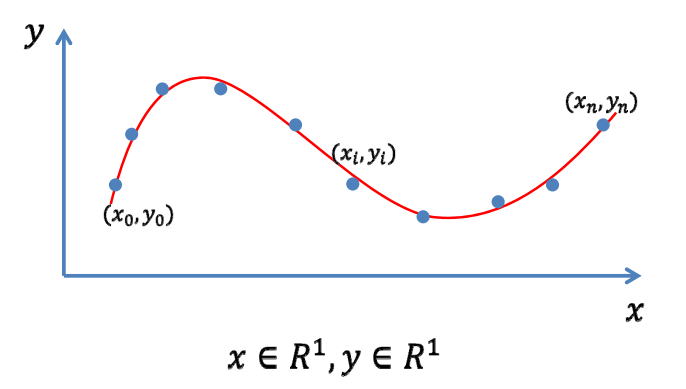
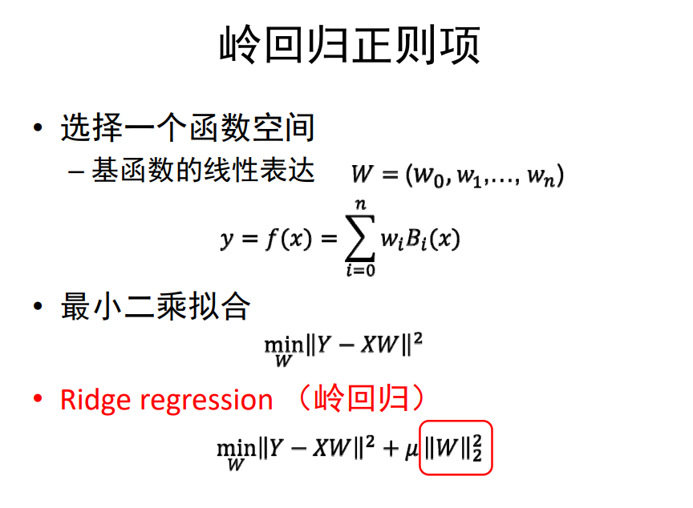
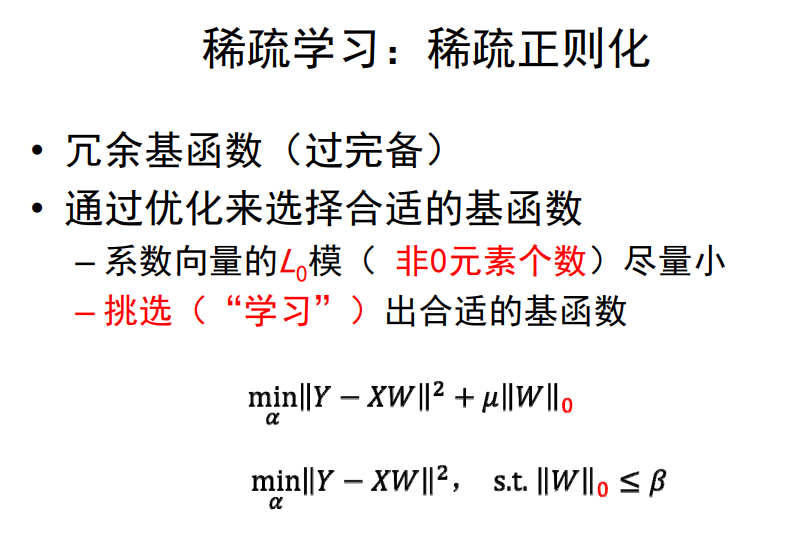

# games102

## P1 课程介绍

计算机图形学：表达与表现三维数据对象，主要分为：建模（内容创建），仿真（内容仿真），渲染（内容呈现）

图像：用**光栅**来离散表达，由像素表的的一些点

2D图形：矢量/几何图形，由点表达的几何元素

栅格图像与矢量图形的区别：栅格图像存储的是像素点的信息，放大后会出现锯齿或失真。而矢量图形是有数学表达的，放大后会重新进行计算，可以无限放大不失真

渲染=解积分方程，仿真=解偏微分方程

### 数据拟合

拟合(fitting)就是输入一些观察的数据点，输出反应这些数据点规律的函数y=f(x)

数据拟合三步骤：

1. 到哪找：选择一个函数空间，常见的函数空间有**多项式函数span**，**RBF函数**，**三角函数**。函数的表达式为$f(x)=\sum_{k=0}^na_kB_K(x)$，即要求出n+1个系数$(a_0,...,a_n)$
2. 找哪个：对于目标是找到函数经过每个数据点时即$y_i=f(x_i)$，可以采用**插值**的方法。对于目标是函数尽量靠近数据点即$min\sum_{i=0}^n(y_i-f(x_i))^2$，可以采用**逼近**的方法，采用该loss函数的意义在于求驻点时求导后得到的是线性函数（比较容易优化）
3. 怎么找：对于目标是每个数据点都要插值即要求$y_i=f(x_i)$，可以通过联立$\sum_{k=0}^na_kB_k(x_i)=y_i,i=0,1,...,n$得到一个(n+1)*(n+1)的线性方程组使用n次Lagrange插值多项式得到结果，但当系数矩阵条件数高时，求解不稳定。对于目标是函数尽量靠近数据点，可以对各系数求导，得到法方程(normal equation)**Ax=b**，求解后得到系数，这种方法就是**最小二乘法**，但是当点多系数少时会出现**欠拟合现象**，当点少系数多时会出现**过拟合现象**

#### Lagrange插值函数 

插值n+1个点、次数不超过n的多项式是存在而且是唯一的，即n+1个变量，n+1个方程，公式为$p_k(x)=\prod\limits_{i\in B_k}\frac{x-x_i}{x_k-x_i}$， 插值函数的自由度 = 未知量个数 - 已知量个数

#### 避免过拟合的常用方法 

- 数据去噪：剔除训练样本中噪声
- 数据增广：增加样本数，或者增加样本的代表性和多样性 
- 模型简化：预测模型过于复杂，拟合了训练样本中的噪声，选用更简单的模型，或者对模型进行裁剪  
- 正则约束：适当的**正则项**，比如方差正则项、稀疏正则项 

#### 岭回归正则项 

#### 稀疏学习：稀疏正则化 

