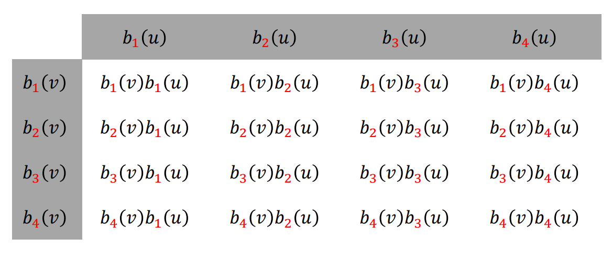
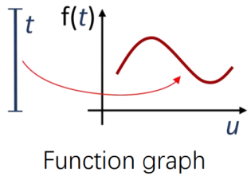
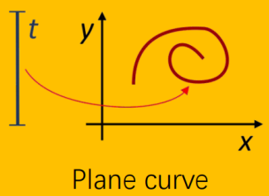
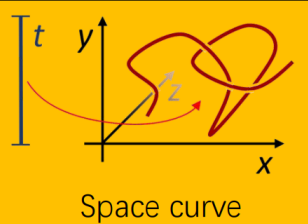
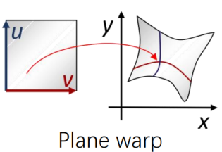
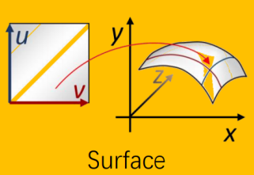
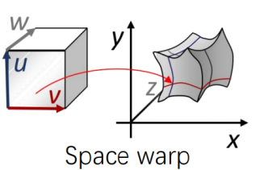
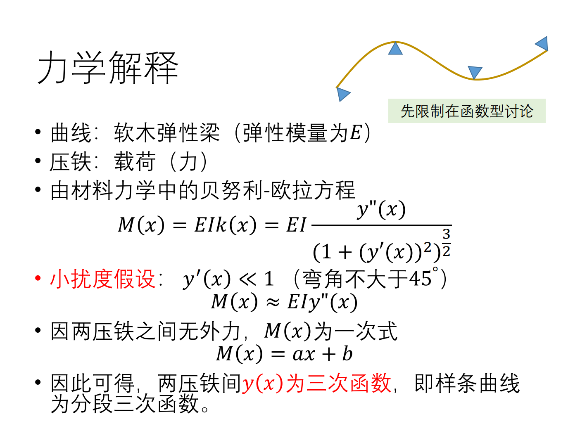
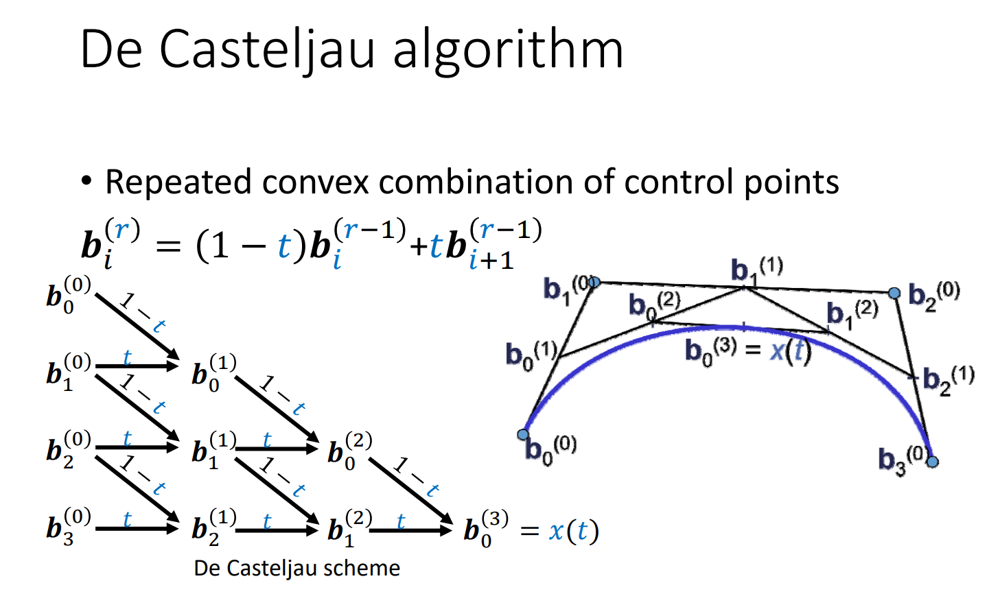

# games102

## P1 课程介绍

计算机图形学：表达与表现三维数据对象，主要分为：建模（内容创建），仿真（内容仿真），渲染（内容呈现）

图像：用**光栅**来离散表达，由像素表的的一些点

2D图形：矢量/几何图形，由点表达的几何元素

栅格图像与矢量图形的区别：栅格图像存储的是像素点的信息，放大后会出现锯齿或失真。而矢量图形是有数学表达的，放大后会重新进行计算，可以无限放大不失真

渲染=解积分方程，仿真=解偏微分方程

### 数据拟合

拟合(fitting)就是输入一些观察的数据点，输出反应这些数据点规律的函数y=f(x)


数据拟合三步骤：

1. 到哪找：选择一个函数空间，常见的函数空间有**多项式函数span**，**RBF函数**，**三角函数**。函数的表达式为$f(x)=\sum_{k=0}^na_kB_K(x)$，即要求出n+1个系数$(a_0,...,a_n)$
2. 找哪个：对于目标是找到函数经过每个数据点时即$y_i=f(x_i)$，可以采用**插值**的方法。对于目标是函数尽量靠近数据点即$min\sum_{i=0}^n(y_i-f(x_i))^2$，可以采用**逼近**的方法，采用该loss函数的意义在于求驻点时求导后得到的是线性函数（比较容易优化）
3. 怎么找：对于目标是每个数据点都要插值即要求$y_i=f(x_i)$，可以通过联立$\sum_{k=0}^na_kB_k(x_i)=y_i,i=0,1,...,n$得到一个(n+1)*(n+1)的线性方程组使用n次Lagrange插值多项式得到结果，但当系数矩阵条件数高时，求解不稳定。对于目标是函数尽量靠近数据点，可以对各系数求导，得到法方程(normal equation)**Ax=b**，求解后得到系数，这种方法就是**最小二乘法**，但是当点多系数少时会出现**欠拟合现象**，当点少系数多时会出现**过拟合现象**

#### Lagrange插值函数 

插值n+1个点、次数不超过n的多项式是存在而且是唯一的，即n+1个变量，n+1个方程，插值基函数为$p_k(x)=\prod\limits_{i\in B_k}\frac{x-x_i}{x_k-x_i}$， 插值函数的自由度 = 未知量个数 - 已知量个数

#### 避免过拟合的常用方法 

- 数据去噪：剔除训练样本中噪声
- 数据增广：增加样本数，或者增加样本的代表性和多样性 
- 模型简化：预测模型过于复杂，拟合了训练样本中的噪声，选用更简单的模型，或者对模型进行裁剪  
- 正则约束：适当的**正则项**，比如方差正则项、稀疏正则项 

#### 岭回归正则项 


#### 稀疏学习：稀疏正则化 


## P2 数据拟合

### [补充学习资料](http://staff.ustc.edu.cn/~lgliu/Courses/GAMES102_2020/documents/GAMES102-suppl-1.pdf)

常见拟合函数：分段线性函数、光滑插值函数、逼近拟合函数

- 分段线性函数：误差为0
- 光滑插值函数：误差为0，但可能被差数据（噪声，outliers）带歪，导致函数性质不好、预测不可靠
- 逼近拟合函数：误差不为0，但足够小

### 多项式插值

#### 拉格朗日插值

多项式基函数为$l_i(x)=\frac{\prod_{j \neq i}(x-x_j)}{\prod_{j \neq i}(x_i - x_j)}$，拉格朗日插值多项式表示为$p(x)=\sum\limits_{i=0}^ny_il_i(x)$

#### 牛顿插值

一阶差商定义$f[x_0,x_1]=\frac{f(x_1)-f(x_0)}{x_1-x_0}$，k阶差商定义$f[x_0,x_1,\cdots,x_k]=\frac{f[x_1,\cdots,x_k]-f[x_0,\cdots,x_{k-1}]}{x_k -x_0}$

牛顿插值多项式表示为$N_n(x)=f(x_0)+f[x_0,x_1](x-x_0)+\cdots+f[x_0,x_1,\cdots,x_n](x-x_0)\cdots(x-x_{n-1})$

### 多项式逼近

#### 最小二乘逼近

对于一组线性无关的基函数$B=\{b_1,...,b_m\}$和一组结点$\{(x_0,y_0),...,(x_n,y_n)\}$，定义损失函数$E(x_0,...,x_n)=\sum\limits_{i=0}^n(y_i-f(x_i))^2$，其中f(x)为B张成的空间。要求一组系数使得损失函数最小，将式子变形并用2-范数表示后得到$E(x0,...,x_n)=\sum\limits_{i=0}^n(y_i-\sum\limits_{j=0}^m \alpha_j b_j(x_i))^2=||Y-X\alpha||_2^2$，其中$Y=(y_0,...,y_n)^T$，$X=\left[\begin{array}{c} b_0(x_0) & b_1(x_0) &  ... & b_m(x_0) \\ \vdots & \vdots & \ddots & \vdots \\ b_0(x_n) & b_1(x_n) & ... & b_m(x_n) \end{array}\right]$，$\alpha=(\alpha_0,...,\alpha_m)^T$，即要求一组$\alpha$使得损失函数最小，使用最小二乘法来进行求解。

$E(x0,...,x_n)=||Y-X\alpha||_2^2=(Y-X\alpha)^T(Y-X\alpha)=(Y^T-\alpha^TX^T)(Y-X\alpha)=Y^TY-Y^TX\alpha-\alpha^TX^TY+\alpha^TX^TX\alpha$

对式子两边的$\alpha$求偏导得$\frac{\partial E}{\partial \alpha}=\frac{Y^TY-Y^TX\alpha-\alpha^TX^TY+\alpha^TX^TX\alpha}{\partial \alpha}=0-X^TY-X^TY+X^TX\alpha+(X^TX)^T\alpha=2X^TX\alpha-2X^TY$，令其等于0得到$X^TX\alpha=X^TY$从而可以得到$\alpha=(X^TX)^{-1}X^TY$

特别的对于最小二乘多项式拟合，即求$\min\limits_{\alpha} \sum\limits_{i=0}^n (y_i-\sum\limits_{j=0}^m \alpha_jx^j)^2$

#### 岭回归正则项						

当最小二乘中$X^TX$接近奇异矩阵（行列式为0）时，求得$(X^TX)^{-1}$结果有较大的误差导致拟合结果不稳定。通过为误差函数添加正则项来使得拟合结果更为稳定。即$\min\limits_{\alpha} \sum\limits_{i=0}^n (y_i-\sum\limits_{j=0}^m \alpha_jx^j)^2+\lambda\sum\limits_{i=0}^m\alpha_i^2, \alpha=[\alpha_0,...,\alpha_m]^T$

按照最小二乘法进行求解得$\sum\limits_{i=0}^n (y_i-\sum\limits_{j=0}^m \alpha_jx^j)^2+\lambda\sum\limits_{i=0}^m\alpha_i^2=(Y-X\alpha)^T(Y-X\alpha)+\lambda\alpha, \frac{\partial(Y-X\alpha)^T(Y-X\alpha)+\lambda\alpha^T\alpha}{\partial\alpha}=2X^TX\alpha-2X^TY+2\lambda\alpha$，令其等于0得$X^TX\alpha-X^TY+\lambda\alpha=0 \rightarrow \alpha=(X^TX+\lambda I)^{-1}X^TY$

### RBF函数插值/逼近

#### Gauss函数

高斯基函数$g_{\mu,\sigma}=\frac{1}{\sqrt{2\pi}}e^{-\frac{(x-\mu)^2}{2\sigma^2}}$，从而得到RBF函数$f(x)=b_0+\sum\limits_{i=1}^nb_ig_i(x)$

## P3 参数曲线拟合	

### 张量积基函数

用一元基函数的相互乘积来定义多元函数的基函数，一般都使用相同的基函数



### 向量值函数

|          | 输出：1D                                                     | 输出：2D                                                     | 输出：3D                                                     |
| -------- | ------------------------------------------------------------ | ------------------------------------------------------------ | ------------------------------------------------------------ |
| 输入：1D |  |  |  |
| 输入：2D |                                                              |  |  |
| 输入：3D |                                                              |                                                              |  |

### 曲线拟合

非函数型曲线拟合，首先用参数化表示$(x,y)$，对于$(x_i,y_i)$对应参数$t_i$，误差度量公式为$E=\sum_{i=1}^n||\begin{pmatrix}     x(t_i) \\ y(t_i) \end{pmatrix} - \begin{pmatrix} x_i \\ y_i \end{pmatrix}||^2=\sum_{i=1}^n||\mathbf{p}(t_i)-\mathbf{p_i}||^2$，极小化误差度量得到的参数一组参数就是所求结果

#### 点列的参数化

- 均匀参数化：$t_{i+1}-t_i=const$
- 弦参数化：$t_{i+1}-t_i=||\mathbf{k_{i+1}}-\mathbf{k_i}||$
- 向心参数化：$t_{i+1}-t_i=\sqrt{||\mathbf{k_{i+1}}-\mathbf{k_i}||}$
- Foley参数化：$t_{i+1}-t_{i}=\left\{           \begin{array}{lr}           d_{i}*(1 + \frac{3}{2}\frac{\hat{\alpha}_{i+1}d_{i}}{d_{i}+d_{i+1}}), & i=0 \\           d_{i}*(1 + \frac{3}{2}\frac{\hat{\alpha}_{i}d_{i-1}}{d_{i-1}+d_{i}}), & i+1=n-1.\\           d_{i}*(1 + \frac{3}{2}\frac{\hat{\alpha}_{i}d_{i-1}}{d_{i-1}+d_{i}} + \frac{3}{2}\frac{\hat{\alpha}_{i+1}d_{i}}{d_{i}+d_{i+1}}), & else           \end{array}\right.$
- Foley参数化参数说明：$d_i=||\mathbf{k_{i+1}}-\mathbf{k_i}||$,$\hat{\alpha}_i=\min{(\frac{\pi}{2},\pi-\alpha_i)}$,$\alpha_i=angle(\bold{P}_{i-1},\bold{P}_{i},\bold{P}_{i+1})$.


## P4 三次样条函数

### [补充学习资料](http://staff.ustc.edu.cn/~lgliu/Courses/GAMES102_2020/documents/GAMES102-suppl-2-CubicSpline.pdf)

### 表达式推导

由力学解释可以推出两个压铁之间的是三次函数即整个样条曲线为分段三次函数



分段3次多项式的好处：

- 2次多项式无法表达拐点，不够自由
- 高次（4次及以上）多项式拐点多，次数若较高计算 易出现较大误差

### 参数连续性

曲线$x_1$和$x_2$在$t_1$称为**$C^r$连续**的，如果它们的从$0^{th}$（0阶）至 $r^{th}$（ 𝑟阶）的导数向量在$t_1$处完全相同。

- C0连续：位置变化连续
- C1连续：一阶导数连续
- C2连续：二阶导数连续

### 几何连续性

- G0连续：表示两曲线有公共的连接端点，与$C0$的条件一致
- G1连续：两曲线在连接点处有公共的切线，即切线方向连续
- G2连续：两曲线在连接点处有公共的曲率圆，即曲率连续

## P5 Bezier曲线 B样条曲线

### Bezier曲线

由于使用幂基来表达曲线没有几何意义且现象不够直观，不利于建模设计。于是有了**Bernstein基函数**表达，使用Bernstein基函数表达系数顶点与曲线的关联性较大，具有很好的几何意义，利于建模设计。

n次Bernstein基函数：$B=\left\{B_0^{(n)}, B_1^{(n)},...,B_n^{(n)} \right\}$，其中$B_i^{(n)}= { n \choose i }t^i(1-t)^{n-i}=B_{i-th\,basis\,function}^{(degree)}，{ n \choose i }为组合数n个中选i个$

对于n次的Bezier曲线，共有n+1个控制点，表达式$R(t)=\sum\limits_{i=0}^nR_iB_i^n(t)$，其中$R_i$为控制点

#### Bezier曲线性质

- 对称性：$B_i^n(t)=B_{n-i}^n(1-t)$
- $B_i^n(t)$在$t=\frac{i}{n}$达到最大值
- 权性：$\sum_{i=1}^nB_i^n(t)=1$
- 正性（非负性）：$B_i^n(t) \ge 0$
- 凸包性：Bezier曲线一定在控制点构成的凸包中
- 基性：可以与幂基相互线性表达
- 递推公式：$B_i^n(t)=(1-t)B_i^{n-1}(t)+tB_{i+1}^{n-1}(t)$，即高阶基函数可以由低阶基函数升阶得到
- 端点插值：$B_0^n(0)=1,B_1^n(0)=\cdots=B_n^n(0)=0$，$B_0^n(1)=\cdots=B_{n-1}^n(1)=0,B_n^n(1)=1$即Bezier曲线一定经过首尾控制点
- 端点切线：$R^{'}(0)=n(R_1-R_0),R^{'}(1)=n(R_n-R_{n-1})$
- 端点二阶切线：$R^{''}(0)=n(n-1)[p_2-2p_1+p_0],R^{''}(1)=n(n-1)[p_n-2p_{n-1}+p_{n-2}]$

#### De Casteljau algorithm

核心公式$b_i^r=(1-t)b_i^{r-1}+tb_{i+1}^{r-1}$，实现算法时间复杂度$O(n^2)$，空间复杂度$O(n^2)$

```cpp
for (int r = 1; r <= n; r++)
    for (int i = 0; i < n - r; i++)
        b(i)(r) = (1-t)*b(i)(r-1) + t*b(i+1)(r-1)
return b(0)(n)
```



#### 几何样条曲线

使用分段Bezier曲线来插值型值点

### B样条曲线

由于Bezier曲线使用的是全局基函数，修改一个控制点会导致整个曲线发生变化，不利于设计。且分段Bezier曲线不好用统一的函数进行表达，于是有了**B样条曲线**。

B样条表达式$P(t)=\sum\limits_{i=0}^nN_{i,k}(t)\cdot p_i$，其中$N_{i,k}(t)$为基函数$当k=1时N_{i,1}(t)=\begin{cases}1,t_i \le t \le t_{i+1} \\ 0, else \end{cases}，当k\gt 1时N_{i,k}(t)=\frac{t-t_i}{t_{i+k-1}-t_i}N_{i,k-1}(t)+\frac{t_{i+k}-t}{t_{i+k}-t_{i+1}}N_{i+1,k-1}(t)$

#### B样条曲线性质

- 当且仅当$t_i \le t \le t_{i+k}$时$N_{i,k}(t) > 0$，当$t_0< t < t_i$或$t_{i+k} < t < t_{n+k}$时$N_{i,k}(t)=0$
- 权性：当$t_{k-1} \le t \le t_{n+1}$时$\sum_{i=0}^n N_{i,k}(t)=1$
- 连续性：当$t_i\le t_j \le t_{i+k}$时$N_{i,k}(t)$在$p_j$处是$C^{k-2}$连续
- 支撑区间（函数值不为0的区间）：$N_{i,k}(t)$的支撑区间为$[t_i, t_{i+k}]$
- 重节点会对连续性有影响（具体影响情况未完全理解）

## P6 NURBS曲线 细分曲线 隐式曲线 NURBS曲面

### NURBS曲线

Non-Uniform Rational B-Spline（非均匀有理B样条）表达式$\mathbf{f}(t)=\frac{\sum_{i=1}^n N_{i,k}(t)\omega_i\mathbf{p}_i}{\sum_{i=1}^nN_{i,k}(t)\omega_i}$

两个层面理解：1. 高一维的齐次坐标空间定义的B样条曲线在欧式空间上的投影 2. 在欧氏空间一组扩展的有理多项式基函数$\frac{ N_{i,k}(t)\omega_i}{\sum_{i=1}^nN_{i,k}(t)\omega_i}$

### 细分曲线

#### Chaikin 细分方法（割角）

Chaikin细分方法流程：

- 每条边取中点，生成新点
- 每个点与其相邻点平均（顺时针）
- 迭代生成曲线

几何规则：新顶点是老顶点的线性组合，新节点生成方法$v_{2i}^{'}=\frac{1}{4}v_{i-1}+\frac{3}{4}v_i, v_{2i+1}^{'}=\frac{3}{4}v_i+\frac{1}{4}v_{i+1}$

性质：极限曲线为二次均匀B样条曲线，节点处$C^1$连续，其余点$C^{\infin}$连续

#### 均匀三次B样条曲线细分方法

生成流程与Chaikin细分类似，新节点生成方法$v_{2i}^{'}=\frac{1}{8}v_{i-1}+\frac{3}{4}v_i+\frac{1}{8}v_{i+1}, v_{2i+1}^{'}=\frac{1}{2}v_i+\frac{1}{2}v_{i+1}$

#### 插值型细分方法（补角）

插值型细分方法：

- 保留原有顶点
- 对每条边，增加一个新顶点
- 不断迭代，生成一条曲线

常见的是4点插值型细分，其规则为$p_{2i+1}^{'}=\frac{p_i+p_{i+1}}{2}+\alpha(\frac{p_i+p_{i+1}}{2}-\frac{p_{i-1}+p_{i+2}}{2})$，对于起始点和结尾点需要特别考虑，可以证明当$\alpha \in (0,\frac{1}{8})$时，生成的细分曲线是光滑的。否则生成的细分曲线是非光滑的

一般的，$2n$点插值细分方法，有2点、4点和6点等插值细分方法

